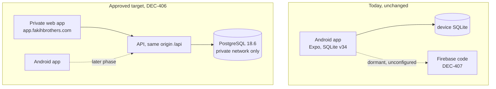

# Web System Architecture

Status: **partly implemented.** The service boundaries below are the approved
target (DEC-406). Only the Phase 1 skeleton exists today.

## How the web system relates to the existing product

DROMEX today is a phone-first, offline-first Expo application whose device
SQLite database is the source of truth. That does not change in this phase.
The web system adds a second client and a shared central database; the Android
application keeps working exactly as it does now until a later, separately
approved synchronisation phase.



Both clients reach shared data only through the API. Neither connects to
PostgreSQL directly.

## Phase 1 scope, implemented

```
web/                     self-contained npm workspace (not the repo root)
  apps/api/              Fastify API: /health and /ready only
  apps/web/              React and Vite development preview
  docker/                local development Compose
```

The workspace is deliberately isolated from the existing application's
`package.json`, which is untouched and has no `workspaces` field.

There is intentionally **no shared domain package**. Sharing business rules
between Android, the API, and the web application is unresolved (OQ-159) and a
separate spike decides it before Phase 3. Creating an empty placeholder would
encode a decision that has not been made.

## Technology baseline

Pinned exactly by DEC-415. Every npm dependency is saved at an exact version
with no range, and `package-lock.json` is retained so `npm ci` reproduces the
tree.

| Component | Version |
| --- | --- |
| Node.js runtime (containers) | 24.20.0 (`node:24.20.0-trixie-slim`) |
| PostgreSQL | 18.6 (`postgres:18.6-trixie`) |
| Fastify | 5.12.3 |
| pg | 8.23.0 |
| React | 19.2.8 |
| Vite | 8.2.2 |
| TypeScript | 7.0.2 |
| Vitest | 5.0.0 |
| Playwright | 1.63.0 |
| Testcontainers (PostgreSQL) | 12.1.0 |

### Node version review point

Node 24 is Active LTS and remains the runtime through the first production
release. Node 26 becomes LTS on 2026-10-28. That is recorded here as a
**future review item only**: it is not adopted automatically, and any move is a
separate decision with its own testing (DEC-415).

### Known deviation: host tooling runs a different Node

The container runtime is Node 24.20.0 as approved. The **development host**
currently runs Node 22.17.1. Every pinned package's `engines` constraint is
satisfied by both, so nothing is incompatible, but local test runs execute on
22.17.1 while the API in Docker executes on 24.20.0. The Docker health
verification is what exercises the approved runtime. This is recorded as a
known gap rather than left implicit.

## Health and readiness

Two endpoints with deliberately different jobs:

- **`GET /health`** is liveness. It answers "is this process up" and touches no
  dependency. It returns `200 {"status":"ok"}` even when PostgreSQL is
  unreachable. Conflating this with readiness would cause an orchestrator to
  restart a perfectly healthy process during a database blip.
- **`GET /ready`** is dependency readiness. It runs `SELECT 1` against
  PostgreSQL and returns `200 {"status":"ready"}` or `503 {"status":"not_ready"}`.
  The underlying database error is logged server-side and **never** included in
  the response body, which is asserted by a test rather than left to intent.

The container health check uses Node's built-in `fetch` rather than `curl`,
because the `slim` image ships neither `curl` nor `wget` and adding one only to
poll a local endpoint would enlarge the image and its attack surface.

## What is deliberately absent

Authentication, business tables, domain rules, and synchronisation are all out
of scope for Phase 1 and are not stubbed, scaffolded, or half-built. Each has a
governing decision or open question that must close first: DEC-408 and OQ-157
for accounts, DEC-409 for the read-only-first rollout, DEC-412 and DEC-413 for
synchronisation, OQ-159 for domain rules.
