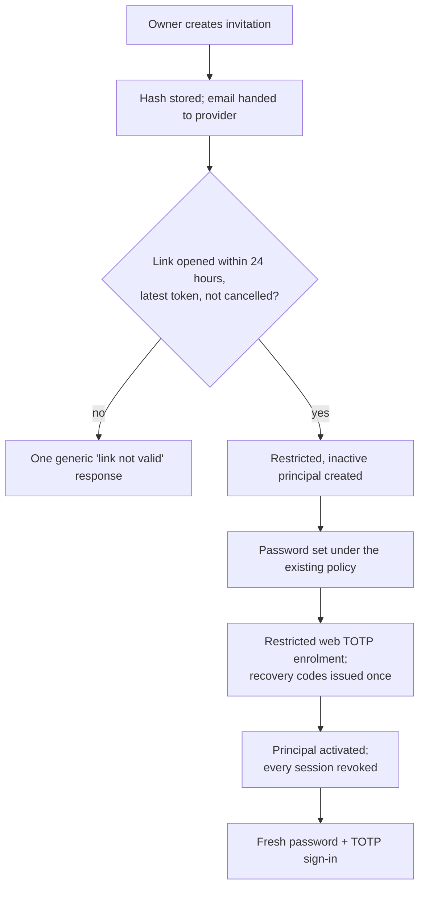
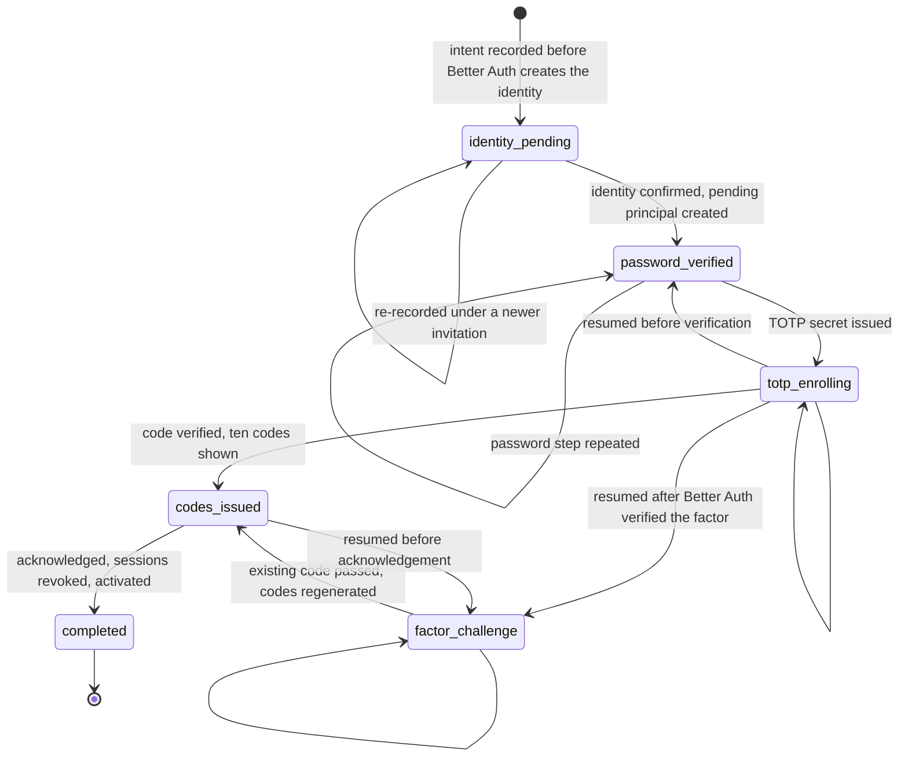

# Authentication and Authorization Architecture

Status: **partly implemented, local development only; not production-ready.**
Implemented and tested against disposable databases: route classification,
Argon2id hashing, the Better Auth configuration and schema, the DROMEX
principal and its migrations, the minimal sign-in, sign-out, and session
transport (see §11, "Implemented transport"), and Owner provisioning tooling
that is **not approved for real use** before MFA (see §11, "Owner provisioning
tooling"). No Owner exists. Everything else here — MFA, recovery, Owner
readiness enforcement, permissions, account management, audit events, the
frontend, and any deployment — remains **design only**. Nothing is
merged, released, or deployed. This document records the approved design so
that no future session has to reconstruct it from chat history.

This document is the detailed companion to
[security-and-accounts.md](security-and-accounts.md), which remains the short
statement of the private-application boundary and the account model. Where
the two overlap, this document is the fuller treatment and
security-and-accounts.md links here rather than duplicating it.

Research conducted 2026-09-11. Decisions recorded here were approved by the
Owner on 2026-09-12 and are numbered DEC-418 through DEC-433 in
`requirements/decisions.md`. Six related questions were opened as OQ-160
through OQ-165 in `requirements/open-questions.md`. **OQ-161 (email delivery)
was closed on 2026-09-16 as a design decision by DEC-439 through DEC-442**
(§14A: approved design only, not implemented). The other five remain open,
are named throughout this document, and **must not be answered here**.

## 1. Plain-language objective

DROMEX holds the operating record of a real construction business: what was
delivered, to whom, at what price, who owes money, what fuel went where, and
which reports were issued to outside parties. The web application puts that
record on a machine reachable from the internet and eventually lets more than
one person write to it. Those two changes are what create the risk the
Android app has been largely free of, because Android has been one person's
device.

The objective: only people the Owner personally created accounts for can get
in; each of them can only do the specific things the Owner decided they can
do; every sensitive action is recorded with their name on it; and when access
is taken away, it is gone immediately, not whenever a session happens to
expire.

Four commitments follow from that:

1. Nothing about the business is visible before sign-in — not data, not a
   project name, not a customer list in page metadata, not a PDF at a
   guessable URL.
2. The server decides, always. A browser or an Android device never tells
   the server what it is allowed to do. Hiding a button is a courtesy to the
   user, never a security control.
3. A password alone is never enough. Every account carries a second factor,
   mandatory for everyone including the Owner.
4. Permission is granted, never assumed. A user who has not been given a
   permission does not have it. Adding a new module to DROMEX never quietly
   hands it to anyone.

**No system here is completely secure.** This design reduces the chance of a
breach, limits the damage of one, and makes one detectable and recoverable.
It does not eliminate the possibility. The largest remaining risks are not
technical: a compromised administrator computer, a leaked backup, and a
trusted insider. Those are addressed by operational discipline, not code.

## 2. Research sources and dates

All research below is current as of **2026-09-11**. Each finding is labelled:

- **Verified** — fetched directly from an official source (product
  documentation, official GitHub repository, npm registry, OWASP, NIST, or
  W3C) during this research pass.
- **Reported** — found by a research pass but not independently re-fetched;
  treat as needing a fresh check before relying on it operationally.
- **Unverified** — could not be confirmed from an official source.

Standards referenced, with links current as of 2026-09-11:

- [OWASP ASVS 5.0.0](https://owasp.org/www-project-application-security-verification-standard/) — released 2025-05-30. ([GitHub tag](https://github.com/OWASP/ASVS/tree/v5.0.0))
- [OWASP Authentication Cheat Sheet](https://cheatsheetseries.owasp.org/cheatsheets/Authentication_Cheat_Sheet.html)
- [OWASP Session Management Cheat Sheet](https://cheatsheetseries.owasp.org/cheatsheets/Session_Management_Cheat_Sheet.html)
- [OWASP Authorization Cheat Sheet](https://cheatsheetseries.owasp.org/cheatsheets/Authorization_Cheat_Sheet.html) (supersedes the deprecated "Access Control Cheat Sheet")
- [OWASP Password Storage Cheat Sheet](https://cheatsheetseries.owasp.org/cheatsheets/Password_Storage_Cheat_Sheet.html) — recommends Argon2id first (m=19456, t=2, p=1), then bcrypt, then scrypt
- [OWASP Cross-Site Request Forgery Prevention Cheat Sheet](https://cheatsheetseries.owasp.org/cheatsheets/Cross-Site_Request_Forgery_Prevention_Cheat_Sheet.html)
- [OWASP API Security Top 10, 2023 edition](https://owasp.org/API-Security/editions/2023/en/0x00-toc/) — still the current official edition as of this research; no newer edition found
- [OWASP Top 10, 2025 edition](https://top10.owasp.org/2025) — A01:2025 Broken Access Control remains #1
- [NIST SP 800-63-4, Digital Identity Guidelines (Final)](https://csrc.nist.gov/pubs/sp/800/63/4/final) — published 2025-07-31
- [W3C WebAuthn Level 3](https://www.w3.org/TR/webauthn-3/) — reached Recommendation 2026-08-25

Candidate research sources are cited inline in §4.

## 3. Full threat model

DROMEX-specific. For each threat: prevention, detection, recovery, residual
risk.

| # | Threat | Prevention | Detection | Recovery | Residual risk |
|---|---|---|---|---|---|
| 1 | Password theft | Mandatory TOTP MFA on every account; Argon2id hashing; breached-password check on set/change; 15+ character passwords recommended, 8 absolute floor, no composition rules, paste and password managers permitted | Audit event on every sign-in with IP and user agent; Owner-visible sign-in history | Owner disables the account; all sessions revoked; password reset; TOTP re-enrolled | A stolen password plus a stolen TOTP seed defeats both factors. Only phishing-resistant WebAuthn closes this — deferred, not excluded |
| 2 | Credential stuffing | No public registration keeps the account set tiny; MFA blocks stuffing even on a correct password; per-account and per-IP rate limiting | Spike in failed sign-ins across accounts | Lockout with Owner-controlled release | Accepted; MFA is the real backstop |
| 3 | Brute force | Rate limiting on sign-in and MFA endpoints, stricter than the global default; exponential backoff; account lockout | Rate-limit rejections logged | Automatic window expiry; Owner can clear a lockout | A slow distributed attack below the threshold remains possible; MFA mitigates |
| 4 | Phishing | Three named users can be told, once, that DROMEX never emails a sign-in link; magic-link and email-OTP authentication are not enabled at all; a single fixed hostname | User reports; sign-in from unexpected geography | Disable, revoke sessions, rotate | **TOTP is phishable in real time.** The largest residual authentication risk; the strongest argument for a future WebAuthn phase |
| 5 | MFA fatigue / recovery abuse | No push-based MFA at all; recovery codes shown once, single-use; regenerating destroys the old set and requires a fresh session and the password | Audit event on every recovery-code use and regeneration | Owner regenerates codes; investigate unexplained use | A user who stores codes badly defeats this — operational, not technical |
| 6 | Lost devices | Recovery codes issued at enrolment; Owner can reset a user's MFA | Owner notices the user cannot sign in | Owner clears the TOTP enrolment, user re-enrols, prior sessions revoked | Owner losing their own device and codes is the catastrophic case — addressed directly in §9 |
| 7 | Session theft | `HttpOnly` so JavaScript cannot read the cookie; `Secure`; `SameSite=Lax`; opaque server-side session ID; **session cookie cache disabled** so revocation is immediate | Session used from a second IP or user agent; per-device session list visible to the Owner | Revoke that session, or all of the user's sessions | A stolen cookie works until noticed or expired; short session lifetime reduces the window |
| 8 | Session fixation | A new session identifier is issued on authentication and re-authentication; the pre-auth session is discarded | Anomalous session lineage in audit events | Revoke and re-authenticate | Low |
| 9 | CSRF | `SameSite=Lax` as defence in depth only; Origin-header validation against an explicit `trustedOrigins` allowlist with no wildcards; state-changing requests required to be non-simple (`Content-Type: application/json`); Fetch Metadata checks | Rejected requests logged | None needed — the request is refused | A browser bug or same-site subdomain takeover could weaken this; no wildcard subdomains permitted |
| 10 | XSS | React's default escaping; no `dangerouslySetInnerHTML`; strict CSP with no `unsafe-inline`; session token never readable by JavaScript; no bearer tokens in the browser | CSP violation reporting; code review | Patch, rotate secrets, revoke all sessions | A successful XSS can still act as the user within their permissions — this is why permissions stay narrow |
| 11 | SQL injection | Parameterized queries everywhere via `pg`; runtime database role holds no DDL and no DELETE | Static analysis; anomalous query errors | Patch; audit what was reachable | Low, given a single data path |
| 12 | Broken access control (A01:2025, still #1) | Deny by default; permission checked at the service/use-case boundary, not only the route; effective permissions read from the database on every request | Denied sensitive actions logged as security events | Correct the policy; review the audit trail | A missing check on one new endpoint is the classic failure — countered by a default-deny route registration pattern, §11 |
| 13 | IDOR | Never trust an identifier from the client; the record is loaded first, its project checked against the caller's scope, then the action permission | Denied access to a specific record logged | Fix the handler; audit what was returned | Any handler bypassing the shared guard — countered by making the guard the only way to load a scoped record |
| 14 | Vertical privilege escalation | Permission set is server-side only; the client never sends its own permissions; Owner status protected by a database constraint; an Admin cannot grant themselves anything | Audit event on every permission change, with actor | Revoke, revert, investigate | An Admin with user-administration permission is powerful by definition — initially only the Owner holds it |
| 15 | Horizontal privilege escalation | Project scope enforced in the same guard as IDOR; no cross-project query without an explicit unscoped permission | Denied access logged with target project | Fix; audit | As #13 |
| 16 | Disabled user retaining a session | Disabling revokes every session in the same transaction; the per-request check reads user status from the database, so a surviving cookie fails immediately | Audit event; any request from a disabled user logged | None needed | This is precisely why the session cookie cache must stay off |
| 17 | Malicious insider | Least privilege via narrow permission blocks; price visibility separated from data entry; nothing hard-deleted; cancellation and correction require a reason and leave history | Append-only audit trail; Owner review of security events | Disable the account; historical attribution preserved | An Admin can still do real damage within their permissions — bounded, not eliminated |
| 18 | Leaked logs | Generic error to the user, detail to the log; never log passwords, tokens, session IDs, TOTP secrets, or recovery codes; log encoding against injection | Secret-scanning log output in CI (OQ-165) | Rotate anything exposed; revoke all sessions | A verbose third-party library logging a header — countered by an explicit redaction list |
| 19 | Leaked backups | Backups encrypted at rest with a key held separately from the backup; off-site copy; restricted access | Access logging on the backup destination | Rotate the encryption key; rotate all credentials; force password and MFA re-enrolment | A leaked backup is a total compromise of the business record — one of the worst outcomes in this model |
| 20 | Leaked `.env` | `web/.env` gitignored, never read into a Claude session; only `.env.example` with placeholders committed; production secrets via Docker secrets; secret scanning | Secret scan on every commit (OQ-165) | Rotate every secret; revoke all sessions; re-issue the Better Auth secret | Human error in a screenshot or a paste |
| 21 | Compromised dependencies | Exact version pins per DEC-415, no floating ranges; committed lockfile; `npm ci` in CI; images pinned by tag and digest in production | `npm audit`; advisory monitoring on Better Auth | Pin back, patch, rebuild, redeploy | A compromised transitive package is genuinely hard to prevent |
| 22 | Compromised administrator computer | MFA on a separate device from the browser; short sessions; per-device session list | Unfamiliar device in the session list | Revoke all sessions; rotate password and MFA | A fully compromised admin machine defeats most controls here — this is honestly the weakest point |
| 23 | VPS compromise | Only 80/443 published; PostgreSQL published on no port at all; `DOCKER-USER` chain rules because Docker-published ports bypass UFW; SSH keys only, root login disabled; least-privilege database roles | Host monitoring; audit-trail anomalies; backup integrity checks | Rebuild from a known image, restore from backup, rotate every secret | Full compromise means full data disclosure |
| 24 | Synchronization replay | Every mutation carries a durable client-generated UUID; the server records applied mutation IDs and ignores repeats; stale mutations rejected rather than blind last-write-wins (DEC-412) | Rejected-conflict count observable and auditable | Client refreshes and re-applies | Bounded by session security |
| 25 | Offline Android device returning after revocation | Device sync requires a live authenticated session; a revoked user's queued mutations are rejected at the boundary | Rejected mutations logged with user and device | Owner decides whether to re-admit any rejected work | **Real operational consequence — the reject-vs-quarantine choice is OQ-163, deliberately not decided here** |
| 26 | Denial of service | Rate limiting; reverse-proxy limits; small connection pool; health checks and restart policies | 503s and rate-limit rejections; uptime monitoring | Restart, scale, block the source | No DDoS protection is in scope |
| 27 | Backup, upgrade, recovery, or rollback mistakes | Rehearsed procedures; a safety copy before any restore; forward-only migrations; a tested rollback path | A restore test that actually runs; backup-failure alerting that reaches a person | The safety copy | An untested backup is not a backup — OQ-158 remains open precisely here |

## 4. Authentication candidate comparison

Nine self-hosted or hosted candidates plus a discouraged baseline were
compared against: Fastify, Node 24, self-hosted PostgreSQL, React/Vite, 3
named users growing to more, no public registration, mandatory TOTP MFA,
possible future Android bearer-token sync, a single-operator maintenance
budget, and a hard rule against rolling custom auth.

### Disqualified, with reasons

- **Auth.js** — no Fastify support, no built-in TOTP, no user management, no
  session revocation, no admin surface (verified from `authjs.dev`).
- **SuperTokens** — Apache 2.0 core, but **TOTP MFA is a paid add-on: $0.01
  per MAU with a $100/month minimum**, even self-hosted (verified from
  `supertokens.com/pricing`). Paying that much for the one non-negotiable
  requirement is poor value.
- **Keycloak** — Apache 2.0, JVM runtime, full admin console, but
  brute-force protection ships **disabled by default**, the Node server
  adapter (`keycloak-connect`) is deprecated, and it carries the largest CVE
  stream of any candidate researched, including CVE-2026-3429 (improper
  access control enabling MFA deletion and account takeover) (reported).
  Disproportionate operational burden for three users on a single VPS
  maintained by one person.
- **Ory Kratos** — Apache 2.0, cleanest CVE record of any candidate
  researched (one SQL-injection advisory, CVE-2026-33503, fixed in
  v26.2.0+). **Headless**: every sign-in, MFA, recovery, and settings screen
  must be built by hand, a separate service must be run and patched, and
  mandatory-MFA enforcement, rate limiting, and enumeration protection are
  all unconfirmed as built-in for self-hosted deployments (reported). That
  is the work of a library plus the work of a server.
- **Zitadel** — the best mandatory-MFA toggle and the best audit
  architecture of any candidate researched (an explicit instance-level
  "Force MFA for all users" setting; event-sourced audit trail). Disqualified
  because **CVE-2025-64103 (CVSS 9.8) was an authentication bypass in
  exactly the MFA-enforcement path** that would be the reason to choose it,
  fixed in 4.6.0/3.4.3/2.71.18 (reported). Combined with a second service, a
  second database lifecycle, and an AGPL-3.0 core license whose
  non-applicability to internal use I could not verify from an official
  page, the balance tips against it. Worth revisiting if DROMEX ever needs
  real multi-tenancy or SAML.
- **Authentik** — MIT core, but requires **four additional services**
  (PostgreSQL, Redis, server, worker), has no official React SDK, and
  general login rate limiting is not confirmed as built-in (reported).
- **Assemble from primitives** — Passport.js is effectively unmaintained;
  OWASP's Session Management Cheat Sheet explicitly discourages rolling your
  own session handling. This is the option `docs/web/security-and-accounts.md`
  already recorded as withdrawn, for the reason recorded there.

### Top two, and the recommendation

**1. Better Auth** — an MIT-licensed library running inside the existing
Fastify process, using the existing PostgreSQL instance, adding no container
and no Redis.

**2. Logto** — an MPL-2.0 self-hosted service with a genuine built-in
mandatory-MFA policy, an official Fastify guide, an official React SDK, and
OIDC-native support for a future Android client. **Not selected**, but
recorded as the strongest self-hosted alternative if Better Auth's
conditions in §5 prove unworkable.

**Selected: Better Auth (DEC-418).** The decisive argument is not feature
count. DROMEX has one operator, an unproven recovery objective (OQ-158), and
a hard requirement that a disabled user loses access immediately. Better
Auth puts users, sessions, two-factor secrets, and recovery data in **the
same PostgreSQL database as the business data**. One backup covers
everything; one restore restores everything consistently; there is no second
service to patch; a session-revocation check is a local query, not a network
call to another system. Every self-hosted alternative researched splits
identity into a second stateful system with its own backup, upgrade path,
and failure mode — on infrastructure that has not yet proven it can meet a
four-hour RTO for *one* database (OQ-158).

**Held as the named fallback (DEC-433): WorkOS (AuthKit).** Free to 1M MAU
with MFA included at every tier, official Fastify and React SDKs, the most
completely documented session-revocation API of any candidate researched
(list sessions with device metadata; revoke one, all, or all-but-current;
emits a `session.revoked` event) (reported). Not selected as primary because
DEC-406 approved a business-controlled VPS as the production architecture,
and WorkOS places user identity and login availability outside that
boundary — a WorkOS outage means nobody can sign in regardless of the VPS's
own health, and migrating off later means re-implementing authentication.
Recorded explicitly so it does not have to be re-researched if self-hosted
authentication proves operationally unsustainable.

## 5. Better Auth: verified capabilities, and what is DROMEX policy

This section is written so a future reader can tell, at a glance, which
statement is a documented product capability and which is a decision DROMEX
is making on top of it.

### Verified from official documentation (`better-auth.com`, the GitHub
repository, and the npm registry), 2026-09-11

- **Version and license**: `better-auth` v1.7.4, MIT license (npm registry).
- **Fastify integration**: a catch-all route handler at `/api/auth/*`
  (`auth.handler(req)`, `fromNodeHeaders`), not a dedicated adapter package.
  CORS via `@fastify/cors`; `trustedOrigins` configured on the `betterAuth()`
  instance.
- **PostgreSQL**: via the Kysely adapter over a standard `pg` `Pool`.
  **Better Auth generates and owns its own tables** through its own CLI,
  invoked as the repository-local pinned binary — `auth@1.7.4`, run as
  `node node_modules/auth/dist/index.mjs generate` (or `migrate`) — never as
  a floating `npx auth@latest`, which would resolve an unpinned version at
  run time. It can be pointed at an existing database. Note that with the
  Kysely/PostgreSQL adapter, `generate` **introspects a live database** to
  compute what is missing, so it requires a reachable server; schema
  generation is therefore run against a disposable database, never against
  the development or production one.
- **Better Auth keeps no migration ledger.** Verified against a disposable
  PostgreSQL 18.6 database on 2026-09-12: after `migrate`, the only tables
  present are Better Auth's own five. The CLI tracks what has been applied by
  introspecting the live schema, so re-running `migrate` reports
  `No migrations needed` and a second `generate` reports
  `Your schema is already up to date`. Replaying the generated `.sql` file
  **by hand** is a different matter and fails with `already exists`, so any
  tooling that applies that file directly needs its own tracking.
- **DROMEX keeps its own ledger, and the two mechanisms never meet.** Better
  Auth discovers its state by introspection; DROMEX records what it applied
  in a `dromex_migration` table (identifier, name, SHA-256 checksum, applied
  timestamp). The DROMEX migrator never reads, applies, or reasons about
  Better Auth's SQL, and Better Auth never sees DROMEX's ledger. Keeping them
  apart is what stops a DROMEX change from being credited to Better Auth's
  schema state, or the reverse (DEC-431). The migrator holds a PostgreSQL
  advisory lock for the whole run so two API instances starting at once
  cannot both apply the same migration — proven by a test that fails when the
  lock is removed — runs each migration in its own transaction alongside its
  ledger row, and fails closed on a changed checksum, a duplicate identifier,
  or a migration recorded as applied but absent from the set.
- **`rateLimit.lastRequest` type — verified 2026-09-13; defect resolved by
  DROMEX-owned storage (Owner decision, Option C).**
  Better Auth's generated SQL declares `lastRequest bigint`, and its runtime
  schema check warns `Expected number but got int8`. Tested through the real
  sign-in route against disposable PostgreSQL 18.6 databases: node-postgres
  returns `int8` to JavaScript as a **string**, and Better Auth's database
  rate limiter converts only a JavaScript `bigint`, so it receives the string
  unchanged.
  - **Enforcement is correct.** Comparisons subtract, which coerces the string
    to a number. The five-attempt, 60-second rule blocks the sixth attempt —
    even with the right password — persists in PostgreSQL across a freshly
    constructed application, resets once the window has elapsed, cannot be
    bypassed with forged forwarding headers, and gives a genuinely different
    socket address its own bucket.
  - **The retry-after value is wrong.** Better Auth computes it as
    `lastRequest + windowInMs`, which concatenates the string; testing
    observed `X-Retry-After: 178928925868309` seconds.
  - **Resolution.** Better Auth 1.7.4 officially supports
    `rateLimit.customStorage` with an atomic `consume(key, { window, max })`
    operation. DROMEX supplies one (`src/auth/rate-limit-storage.ts`) backed
    by its own `dromex_rate_limit` table, created by DROMEX migration `0002`
    through the DROMEX ledger. Its `last_request_ms` column is `BIGINT`,
    converted explicitly: only canonical non-negative integer text within
    `Number.MAX_SAFE_INTEGER` is accepted, and anything else fails closed
    without changing the row. Each decision runs in one transaction under a
    `SELECT … FOR UPDATE` row lock, so concurrent requests can neither lose
    an increment nor be over-granted. The retry time is
    `ceil((last + window − now) / 1000)`, clamped to `1…window`.
  - **Rejected alternatives.** A global node-postgres `int8` parser would
    silently change every `BIGINT` read in the process, including future
    business columns where exact 64-bit values matter. Editing Better Auth's
    generated schema would break the separation of the two migration
    sequences (DEC-431) and be overwritten by the next generation. Better
    Auth's generated `rateLimit` table is left exactly as generated
    (`storage: 'database'` is kept for that reason) and is no longer written.
  - **Verified:** the sixth attempt is blocked with `Retry-After` between 1
    and 60; state survives a fresh server instance; 12 concurrent sign-ins
    yield exactly five 401s and seven 429s; forged forwarding headers create
    no new bucket; the global `BIGINT` parser is unchanged. Removing the row
    lock makes the concurrency test fail.
- **Two-factor plugin (`twoFactor`)**: TOTP enrolment returns `{ method,
  totpURI, backupCodes }`; verification accepts one period before and after
  the current code — about 90 seconds in all, with no replay protection of
  its own. `skipVerificationOnEnable` defaults to `false`. `trustDevice`,
  when used, trusts a device for 30 days, and **1.7.4 has no option that
  disables it**. *Corrected 2026-09-14 against the installed 1.7.4 source.*
- **Backup codes** *(corrected 2026-09-14 against the installed 1.7.4
  source)*: `backupCodeOptions` defaults to `amount: 10`, `length: 10`
  (10 characters from 62 symbols, about 59.5 bits). **`storeBackupCodes`
  defaults to `"encrypted"` in 1.7.4**, not `"plain"` as this section
  previously stated; it accepts `"plain"`, `"encrypted"`, or a custom
  `{ encrypt, decrypt }` pair, which encrypts the whole code list as one
  blob. **All three are reversible; none is a one-way hash**, and
  verification decrypts the list and compares the submitted code by exact
  string match. `customBackupCodesGenerate` controls only generation.
  **One-way hashed storage of backup codes is not supported in any
  configuration.** `generateBackupCodes()` overwrites the previous set. A
  used code is removed under a compare-and-swap and cannot be reused.
  **`viewBackupCodes()` is server-only** — created with
  `createAuthEndpoint.serverOnly`, which the router never mounts — and in
  the installed source it **enforces no session, freshness, or password
  check**: it takes a bare `userId`. The official documentation calls it
  server-only yet also lists an HTTP path and advises a fresh session; the
  source is authoritative. DROMEX's hardened configuration is recorded in
  DEC-435.
- **Schema versus documentation** *(verified 2026-09-14)*: the generated
  `twoFactor` table has **no `createdAt`** although the documentation lists
  one; `userId` is indexed but **not unique**; and the encrypted `secret`
  column is indexed. The plugin schema declares `verified` defaulting to
  `true` and `failedVerificationCount` to `0`, but **the generated PostgreSQL
  columns carry no default for either**: Better Auth's adapter supplies both
  at runtime (verified 2026-09-14; see checkpoint 3F-B in §11).
- **Ambient secret override** *(verified 2026-09-14)*: when `secrets` is not
  set explicitly, Better Auth reads `BETTER_AUTH_SECRETS` from the process
  environment on its own, and `BETTER_AUTH_SECRET` or `AUTH_SECRET` as a
  legacy fallback. DROMEX sets `secrets` explicitly and refuses to start if
  any of the three is present (DEC-434).
- **Mandatory MFA is not a built-in policy.** The documentation states only
  that "2FA sign-in enforcement applies to the credential-based sign-in
  endpoints"; other methods need custom hooks. Enforcing MFA for every
  account is application-layer work.
- **Admin plugin**: `createUser`, `listUsers`, `getUser`, `updateUser`,
  `removeUser`, `setRole`, `banUser` (reason and optional expiry —
  **verified: banning immediately revokes all of the user's existing
  sessions**, not merely future sign-in), `unbanUser`, `setUserPassword`,
  `listUserSessions`, `revokeUserSession` (one), `revokeUserSessions` (all
  for a user), `impersonateUser`, `stopImpersonating`.
- **No admin-side function for resetting or clearing another user's TOTP
  enrolment is documented anywhere in the admin plugin.** Checked directly
  against the admin plugin reference — not found.
- **No built-in concept of a protected "super admin" role that other admins
  cannot modify is documented.** `adminRoles`/`adminUserIds` configure who
  holds admin capabilities, but nothing in the plugin itself prevents one
  admin from altering another's role.
- **No admin capability to view or export another user's backup codes is
  documented.**
- **User-initiated TOTP removal**: `twoFactor.disable()`, requiring the
  password (or nothing, if `allowPasswordless` is enabled) — this requires
  an existing valid session, so it is not reachable by a fully locked-out
  user.
- **Sessions**: database-backed; `session_token` is an opaque signed cookie
  identifier. Default `expiresIn` 7 days, `updateAge` 1 day.
  `revokeSession({token})`, `revokeOtherSessions()`, `revokeSessions()`.
  `freshAge` (default 1 day) gates sensitive endpoints.
  **`session.cookieCache`, if enabled, means a revoked session can remain
  active on other devices until the cache's `maxAge` expires** — the
  documentation states this plainly.
- **Cookies**: `httpOnly` and `secure` in production; `SameSite=Lax` by
  default; `useSecureCookies: true` to force.
- **CSRF**: layered — Origin-header verification against `trustedOrigins`;
  a preference for non-simple requests (`Content-Type: application/json`);
  `SameSite=Lax`; Fetch Metadata blocking of cross-site navigation.
- **Password hashing**: `scrypt` by default, overridable via custom
  `hash`/`verify` functions.
- **Rate limiting**: built in. Production default 100 requests per 60
  seconds; **disabled in development by default**. Storage: memory
  (default), `"database"`, `"secondary-storage"`, or custom. Per-path
  `customRules`.
- **Bearer plugin**: issues a token in a `set-auth-token` response header,
  sent as `Authorization: Bearer`. The documentation warns it is "intended
  only for APIs that don't support cookies" and that "improper
  implementation could easily lead to security vulnerabilities," without
  elaborating on the specific XSS/CSRF trade-off.
- **Security advisories** *(corrected 2026-09-14)*: **32 are published**
  across four pages of the repository's advisories page, not the 10 first
  recorded here; the newest verified on 2026-09-14 is dated 2026-08-11. The
  earlier statement that every advisory sits in SSO, SCIM, OIDC-provider,
  Stripe, magic-link, or email-OTP was **false**. Advisories in areas this
  design does use include:
  - `GHSA-xg6x-h9c9-2m83` (High): two-factor authentication bypass through
    premature session caching, when both 2FA and `session.cookieCache` are
    enabled; affected 1.4.5, **fixed in 1.4.9**. DROMEX disables the cookie
    cache (DEC-420).
  - `GHSA-vp58-j275-797x` (High): bypass of `trustedOrigins` protection
    leading to account takeover (2025-02-24).
  - `GHSA-x732-6j76-qmhm` (High): double-slash path normalisation bypassing
    `disabledPaths` and rate limits; **fixed in 1.4.6**.
  - `GHSA-p6v2-xcpg-h6xw` (High): rate limiter keying IPv6 addresses
    individually, bypassable by prefix rotation; **fixed in 1.4.17**.
  - `GHSA-2vg6-77g8-24mp` (Low): stale sessions after user deletion with
    secondary storage; **fixed in 1.6.11**.

  **Better Auth 1.7.4 is not affected by any of them.** Others concern
  SSO, SCIM, OIDC-provider, OAuth, Stripe, magic-link, email-OTP, passkeys,
  API keys, organization invitations, multi-session, open redirects, and
  reflected XSS. This remains time-bounded evidence, not a guarantee about
  the code DROMEX uses. Ongoing version upgrades (DEC-431), the testing
  strategy in §19, and advisory monitoring remain required. The repository
  states it supports only the latest version; there are no backported
  patches.
- **Not stated in official documentation, checked directly and confirmed
  absent**: whether one account can hold more than one enrolled TOTP
  authenticator at a time; an automatic low-backup-code warning; a
  count-only endpoint for remaining backup codes.

### DROMEX application policy built on top of the above

None of the following is a Better Auth feature. All of it is DROMEX's own
enforcement, required by the decisions cited inline below and recorded in
`requirements/decisions.md`.

- Overriding password hashing to Argon2id (DEC-419), because `scrypt` is
  acceptable but not OWASP's first choice.
- Disabling `session.cookieCache` entirely (DEC-420), because its documented
  behaviour is incompatible with immediate revocation.
- Neutralising `trustDevice` (DEC-421, DEC-434), because a 30-day MFA bypass
  contradicts mandatory MFA and 1.7.4 cannot switch it off: DROMEX forces
  `trustDevice: false`, drops any incoming trusted-device cookie, never
  forwards one, and pins its lifetime to one second.
- Enforcing mandatory MFA for every account at a single authorization gate
  (DEC-421, DEC-434): Better Auth session, active principal,
  `twoFactorEnabled`, `mfa_completed_at`, and a session no older than MFA
  completion must all agree. There are no web enrolment endpoints; the
  Owner enrols in the terminal.
- Recording every accepted TOTP code in `dromex_totp_replay` (DEC-434),
  because Better Auth accepts a code repeatedly within its window.
- Explicit versioned `secrets`, refusing ambient Better Auth secret
  variables (DEC-434).
- Enabling no feature DROMEX does not need — no SSO, SCIM, OIDC-provider,
  Stripe, magic-link, or email-OTP (DEC-422). Every published advisory
  found lives in those, so not enabling them is a deliberate reduction of
  attack surface — **it reduces exposure to known past issues; it is not
  proof that the remaining, enabled surface is safe.**
- Pinning `storeBackupCodes: "encrypted"` explicitly (DEC-423, DEC-435) —
  1.7.4's default is already `"encrypted"`, and it is pinned so a future
  default change cannot silently weaken it — and replacing the 59.5-bit
  default codes with 10 generated 24-symbol Crockford Base32 codes of
  exactly 120 bits each. This is **explicitly still reversible encryption,
  not a one-way hash**, which Better Auth does not support for backup codes
  in any configuration: an **accepted deviation from NIST SP 800-63B Rev. 4
  §3.1.2.2** (DEC-435). At 120 bits the codes are outside ASVS 5.0.0 6.5.2,
  which requires hashing only below 112 bits. The Owner-specific recovery
  design in §14 closes what storage alone cannot.
- Every part of authorization: role templates, per-user overrides, project
  scope, effective-permission computation, the business audit trail, and
  invitation onboarding (§6 through §11) — Better Auth provides none of
  this, by design, so it lives entirely in DROMEX's own schema under
  DROMEX's own migrations.

## 6. Owner and Admin account model

Implements DEC-408 without change.

- Exactly one Owner **once the system is initialised** — but that rule is
  assembled from three mechanisms, and it is worth being precise about which
  one does what, because the imprecise version invites a false sense of
  safety:

  | Mechanism | Guarantees | Status |
  |---|---|---|
  | Partial unique index on `is_owner WHERE is_owner` (DEC-426) | **At most** one Owner. A second is impossible | **Implemented** (`dromex_principal`, migration `dromex/0001`) |
  | Bootstrap workflow (DEC-426's "bootstrap transaction") | Creates the first and only Owner | **Tooling implemented and tested on disposable databases only; not approved for real use before MFA; no Owner exists.** It is *not* one transaction: Better Auth's identity commit and DROMEX's Owner commit are separate, bridged by a resumable intent under an advisory lock (§11, "Owner provisioning tooling") |
  | Runtime readiness + service rules | Refuse an initialised system with no Owner; refuse to remove or demote the Owner | **Not implemented** |

  A unique index can only forbid a second row; it cannot require a first.
  **Zero Owners is therefore a legitimate, expected state before bootstrap**,
  and the schema deliberately permits it — a test asserts this. No trigger or
  placeholder Owner row is used to force existence, because a fabricated
  Owner would be worse than an absent one. Until the readiness check exists,
  nothing detects an initialised system that has lost its Owner.
- Two individually named Admins at launch, identical initial permissions,
  each with their own credentials. No shared credential ever exists.
- No public registration. The only way an account comes into being is the
  Owner creating it.
- Only the Owner manages accounts, role templates, permissions, project
  scope, other users' sessions, and recovery.
- An Admin can never disable, delete, demote, rename, or replace the Owner,
  nor revoke a permission the Owner granted, nor grant themselves anything.
- **Owner self-protection (DEC-426)**: any operation that would remove
  `users.manage` or `security.manage` from the Owner, or clear `is_owner`,
  is rejected at the service layer.
- Disabled users keep their history. Disabling sets a status and revokes
  sessions; it never deletes the user row, because loads, reports,
  corrections, and payments reference their stable user ID (DEC-427).
  Deletion is not offered.
- Growth: additional individually named users are created the same way,
  differing only in template and overrides. Nothing in this model is
  specific to three users.

## 7. Role-template architecture

A template is a **named starting set of permissions** and nothing more; it
is convenience, not authority (DEC-424).

- Templates seeded at launch: Owner, Admin, and drafts for Plant
  Administrator, Accountant, Fuel Operator, Project Engineer, Report Viewer,
  and Custom. Only Owner and Admin are assigned initially.
- Assigning a template copies its permissions into the user's effective set
  at assignment time. The template name is stored so the Owner can see it,
  but **the name never controls access** — the effective set does.
- Editing a template does not silently re-flow to existing users. The Owner
  is shown which users hold that template and what would change, and
  applies it explicitly per user, creating an audit event.
- **New modules never arrive silently (DEC-425)**: when DROMEX gains a
  module, its permission keys are added to the catalog **ungranted**. No
  template and no user receives them automatically. The Owner grants them
  deliberately.

## 8. Permission blocks

Permissions name protected business actions, not screens, in the form
`module.action`. Absence means denial. Each split below passed the test:
*could a real DROMEX person reasonably be allowed one action and not the
other?*

| Module | Permission keys | Project-scoped? |
|---|---|---|
| Projects | `projects.view`, `.create`, `.edit`, `.complete`, `.reactivate` | view/edit |
| Company Loads | `loads.view`, `.create`, `.confirm`, `.correct`, `.cancel`, `.print`, `.view_prices`, `.manage_prices` | ✅ |
| Supplier Loads | `supplier_loads.view`, `.create`, `.correct`, `.cancel`, `.reactivate`, `.print`, `.view_prices`, `.manage_prices` | ✅ |
| Fuel Ledger | `fuel.view`, `.record_fill`, `.record_delivery`, `.record_gauge`, `.correct`, `.cancel`, `.view_prices`, `.manage_prices` | ✅ fills |
| Daily Reports | `daily_reports.view`, `.create`, `.edit`, `.export`, `.view_prices` | ✅ |
| Business Reports | `business_reports.view`, `.export`, `.view_prices` | ❌ cross-project |
| Financials | `financials.view`, `.view_prices`, `.export` | ✅ |
| Payments | `payments.view`, `.record`, `.cancel` | ✅ |
| Customers | `customers.view`, `.create`, `.edit`, `.deactivate`, `.merge`, `.view_balances` | ❌ |
| Suppliers | `suppliers.view`, `.create`, `.edit`, `.deactivate`, `.merge`, `.view_balances` | ❌ |
| Workers and Drivers | `people.view`, `.create`, `.edit`, `.deactivate` | ❌ |
| Trucks and Machines | `equipment.view`, `.create`, `.edit`, `.deactivate` | ❌ |
| Catalog | `catalog.view`, `.create`, `.edit`, `.deactivate` | ❌ |
| Units and Conversions | `units.view`, `.manage` | ❌ |
| Waste Dumps | `waste.view`, `.record`, `.cancel` | ✅ |
| Walls | `walls.view`, `.record`, `.edit` | ✅ |
| Pavement | `pavement.view`, `.calculate`, `.export` | ✅ |
| Schedule | `schedule.view`, `.manage` | ✅ |
| PDF Settings | `pdf_settings.view`, `.manage` | ❌ |
| Company Settings | `company_settings.view`, `.manage` | ❌ |
| Backup and Restore | `backup.create`, `.restore` | ❌ |
| Exports | inherits per module `.export`/`.print` | ✅ inherits |
| User and Permission Administration | `users.view`, `.create`, `.edit`, `.disable`, `.manage_permissions`, `.manage_sessions`, `security.view_audit`, `security.manage` | ❌, Owner-only at launch |

Actions deliberately merged rather than split, with reasons: *Edit* and
*Correct* are distinct only where the record is confirmed (loads, supplier
loads, fuel); *Print* merges into *Export* except for loads, where a
reprint carries the COPY marking of DEC-386; *Confirm* exists only for
company loads, the one workflow with a real draft-to-confirmed transition;
*Manage settings* is per-module so PDF Settings can be granted without
Company Settings.

### Worked example: Plant Administrator

Template grants: `loads.view/create/confirm/print`; `fuel.view/record_fill`;
`projects.view`; `equipment.view`; `catalog.view`; `units.view`;
`people.view`. Not granted, therefore denied: everything in Daily Reports,
Business Reports, Financials, Payments, User Administration, Backup and
Restore, PDF Settings, Company Settings, Supplier Loads, Waste, Walls,
Pavement, Schedule, every `view_prices`/`manage_prices` key,
`loads.correct/cancel`, `fuel.record_gauge/record_delivery/correct/cancel`.
Project scope: the plants they actually run. **Price visibility is fully
separate from fuel or load entry** — they record a load without ever seeing
its value; **correction, cancellation, confirmation, gauge readings,
fuel-price management, and transaction creation are each independently
assignable**, satisfying the requirement directly.

The Owner opens this profile and sees the assigned template, which
permissions came from it, which were added individually with reason and
date, which were revoked individually with reason and date, the project
scope, a plain-language effective-access summary, and who last changed
access and when.

## 9. Per-user override model

**Effective permissions = (template grants ∪ individual grants) −
individual revocations**, filtered by project scope for scoped permissions.
Deny by default: anything not in the result is denied (DEC-424).

- Every override records the permission key, grant or revoke, the reason
  the Owner typed, who made the change, and when.
- **An individual revocation always wins over a template grant.** This is
  the only form of denial in the model — there are no general explicit-deny
  rules, kept out deliberately to keep the model simple.
- Because `users.manage_permissions` is Owner-only at launch, an Admin
  cannot restore a permission the Owner revoked; that is structurally true
  today. When it is ever delegated, an Owner-created override must
  additionally be marked Owner-locked and unmodifiable by a non-Owner.
- Computation happens in one function, in one module, used by every caller
  — no second implementation in the UI, a query, or SQL.
- **Sensitive changes revoke sessions (DEC-427)**: any revocation, template
  change, project-scope narrowing, or disabling calls
  `revokeUserSessions()` for that user.

## 10. Project-scope model

- A user is either unscoped (every project, present and future) or scoped
  to an explicit list. An empty scoped list means no projects — deny by
  default holds even here.
- Scope applies only to project-scoped permissions. Reference data —
  catalog, units, equipment, people — is never project-scoped, because a
  scoped user still needs to resolve an item name to record a valid load.
- **Enforcement happens on the record, never on a client-supplied request
  parameter.** The record is loaded, its true `project_id` is read from the
  database, and that value is checked. This single rule is what prevents
  IDOR (DEC-428).
- New projects do not flow to scoped users automatically, following the
  same principle as new modules.
- Cross-project aggregate reports require an unscoped permission, because an
  aggregate that silently drops out-of-scope rows would mislead the reader.
- Historical attribution ignores scope. Removing a project from a user's
  scope hides it going forward; it never erases their name from records they
  created.

## 11. API enforcement design

**Browser pages and hidden buttons are never a security boundary (DEC-409).
Every protected API route or use case must explicitly declare and enforce
its own authorization policy; there is no route that is protected "by
default" through some other route's check (DEC-428).**

Fastify `preHandler` hooks, layered in order:

1. **Authentication** — resolve the session from the cookie via
   `auth.api.getSession()`. No session, no access.
2. **Account status** — the user must exist, be enabled, and be
   MFA-enrolled, read fresh from the database on every request. A disabled
   user with a valid cookie is refused here, which is what makes revocation
   immediate.
3. **Effective permissions** — computed by the one function from §9,
   attached to the request.
4. **Permission requirement** — `requirePermission('loads.confirm')`.
   **Route registration is default-deny: a route that has not declared
   either a required permission or an explicit public-route allowlist
   entry fails at server startup, not at request time.** A small number of
   routes are genuinely public before authentication exists at all —
   `/health` and `/ready` are the only ones today — and these must be
   **explicitly named on an allowlist**, never merely left undeclared;
   "undeclared" and "intentionally public" are not the same state, and the
   startup check must be able to tell them apart.
5. **Record load and scope check** — for any operation on an existing
   record, the service loads it, reads its true `project_id` **from the
   database**, and checks that stored value against the caller's scope
   before acting. A project or record identifier supplied by the client is
   never trusted as the basis for a scope decision — only the value
   already stored on the server-side record is.

Enforcement lives at the **service/use-case boundary**, not only the route,
so a future synchronization endpoint, background job, or Android sync path
reaching the same use case inherits the same check rather than needing a
second copy — the deep-module shape the installed `codebase-design` skill
describes, mirroring the existing Android `LoadRepository` interface /
`SqliteLoadRepository` implementation split.

Stable identity per DEC-410: server-minted rows use PostgreSQL 18's native
`uuidv7()`. The Android `makeId` helper (`Date.now()` base-36 plus
`Math.random()`, duplicated across `SqliteLoadRepository.ts:74`,
`SqliteCatalogRepository.ts:30`, `SqliteProfileRepository.ts:52`,
`SqliteProjectReportRepository.ts:21`, `SqliteQuarryRepository.ts:31`) must
not be reused for server rows — it is not collision-resistant across
devices.

Errors are generic to the user, detailed to the log, with a correlation ID
— the pattern already implemented and tested on `/ready`. 403 and 404 are
deliberately indistinguishable for records outside a user's scope, so scope
cannot be used to enumerate what exists.

### Implemented transport (Phase 2C checkpoint 3D, local development only)

Status: **implemented and verified against disposable PostgreSQL 18.6
databases; not production-ready.** MFA, Owner bootstrap, permissions, account
management, and the frontend are not implemented.

*Superseded in part by checkpoint 3F-B, below: mandatory TOTP MFA is now
enforced, a fourth route exists, and a correct password alone no longer
yields a session. This section remains the record of the 3D transport.*

**Exact route surface.** Three authentication routes exist, and nothing else:

| Method | Path | Classification |
|---|---|---|
| `POST` | `/api/auth/sign-in/email` | `guest-only` |
| `POST` | `/api/auth/sign-out` | `session-cleanup` |
| `GET` | `/api/session` | `authenticated` |

There is **no catch-all route**. Better Auth's documented Fastify integration
mounts a handler at `/api/auth/*`; DROMEX deliberately does not. Each approved
route forwards to one fixed Better Auth path, so a client query string or path
suffix never reaches Better Auth. Any other path — sign-up, raw `get-session`,
password reset, account updates, provider or plugin routes — is answered by a
generic 404 that never touches Better Auth. `/health` and `/ready` remain
explicitly `public`.

**The active principal is enforced twice.**

1. *At issuance.* A `session.create.before` database hook, built into
   `createAuthOptions` so that no construction path can omit it, returns
   `false` unless the user has an active principal. Better Auth then aborts
   the insert, so a user with a missing or disabled principal is never issued
   a session: the row is never written, rather than written and hidden. A
   failed lookup throws, which also aborts.
2. *On every request.* The request-time guard resolves the session and then
   requires an active principal from PostgreSQL. Missing, malformed, expired,
   revoked, orphaned, and disabled-principal sessions all receive one
   identical `401`.

**Session resolution bypasses Better Auth's router.** Sessions are resolved
with `auth.api.getSession({ headers, asResponse: true })` rather than through
the HTTP router, so an authenticated request neither consumes a rate-limit
bucket nor writes a rate-limit row, while refresh and expiry `Set-Cookie`
headers are still forwarded.

**Raw Better Auth output is never returned.** `/api/session` returns exactly
`{ "user": { "id", "name", "email" }, "isOwner" }`. The sign-in body is
replaced with `{ "authenticated": true }`, because Better Auth's own body
carries the session token.

**Sign-in failures are normalised.** Unknown email, wrong password, missing
principal, disabled principal, malformed input, and a refused Origin all
return `401 { "error": "invalid_credentials" }` with no cookie. A rate-limited
attempt returns `429 { "error": "too_many_requests" }` with a standard
`Retry-After` header; the transport forwards it only when it is an integer
from 1 to 3600 and never forwards Better Auth's `X-Retry-After`. Timing
equivalence has **not** been measured.

**Client address.** The transport discards every client-supplied address
header (`x-forwarded-for`, `x-real-ip`, `forwarded`, `cf-connecting-ip`,
`true-client-ip`, and similar) and sets `x-dromex-client-ip` from Fastify's
socket address, with `trustProxy` disabled. Better Auth is configured to read
only that header. Trusting a reverse proxy is deferred until one exists and
can be configured to overwrite forwarded headers.

**CSRF boundary.** Better Auth's Origin checks protect sign-in whenever an
Origin, Referer, Fetch Metadata header, or cookie is present. Sign-out has its
own DROMEX exact-match Origin check against the trusted origins, because
Better Auth skips its check when no cookie is sent; a missing, opaque
(`null`), or untrusted Origin receives `403` before Better Auth is reached. No
general DROMEX Fastify-level Origin policy exists yet; one is required before
the first state-changing DROMEX business route.

**Configuration fails closed.** `buildServer` requires explicit
authentication settings and a database URL. The executable entry point reads
them once from the environment through a validated boundary whose errors name
variables, never values. `web/.env.example` leaves the secret empty, so the
API refuses to start until a real one is set. The local Docker Compose `api`
service does not yet supply these variables and will not start until it does;
that file is unchanged.

**Sign-out is security cleanup (Owner decision, 2026-09-13).** It is
classified `session-cleanup`, a fourth route classification that the
request-time guard lets through without resolving a session or principal.
This is deliberate: sign-out only destroys the caller's own authentication
state and reveals nothing, so a user whose principal is disabled or missing
must still be able to revoke their session. Better Auth revokes the session
named by the caller's own signed cookie (never another user's) and expires the
session cookies. The response is one generic `200 { "signedOut": true }` with
cookie-clearing headers whether the session was valid, expired, malformed,
missing, already revoked, or belonged to a disabled or missing principal. A
failed revocation is reported as `500`, never as success. `GET` is `404`.
This does **not** widen access anywhere else: a missing or disabled principal
still receives `401` from `/api/session` and from every `authenticated` route.

### Owner provisioning tooling (Phase 2C checkpoint 3E, disposable databases only)

Status: **implemented and tested against disposable PostgreSQL 18.6 databases
only. Not approved for real use.** No Owner exists, and none may be created
until mandatory MFA and recovery are implemented and separately approved
(DEC-421, DEC-423). Owner readiness enforcement — refusing an initialised
system that has no Owner, and refusing removal or demotion of the Owner —
remains **unimplemented**.

*Extended by checkpoint 3F-B, below: the workflow now enrols and verifies
TOTP, issues recovery codes, requires typed acknowledgements, and records
`mfa_completed_at`. The command is unchanged and still refuses every run.*

**A local, interactive command; never HTTP.** The Owner is created only by
`apps/api/src/provisioning/owner-command.ts`, run by a person at a terminal.
There is no setup route, no temporary bootstrap website, no public
registration, no default Owner, and no shared credential. A test walks the
server's import graph and proves no provisioning module is reachable from
`server.ts`, and the complete route table is asserted unchanged.

- The only accepted input is `--database-url-file <path>` (and `--help`). A
  password or connection string given as an argument is refused and never
  echoed; the environment is never read, so it cannot supply either.
- **Pre-MFA gate.** Every run except `--help` is refused with "Production
  Owner provisioning is unavailable until mandatory MFA and recovery are
  implemented and approved", exit status 1, before any file is read, any
  prompt is shown, or any connection is opened. No flag, environment variable,
  or hidden switch enables it: enabling it is a reviewed code change in a
  later, separately approved checkpoint. The service below is exercised only
  by automated tests against disposable databases.
- **Hidden prompt** (`terminal-prompt.ts`, Node's own raw-mode TTY only, no
  dependency). The password and its confirmation echo nothing at all, not
  even a mask character, so neither the password nor its length reaches the
  screen. Password-manager paste works, including bracketed-paste markers;
  backspace and delete work; terminal escape sequences are discarded; Ctrl+C
  or Ctrl+D cancels, empties the per-character buffer, and restores the
  terminal. It refuses when input or output is not a terminal, and there is
  no piped-input fallback. *Honest limit:* a JavaScript string cannot be
  zeroed, so the completed entry lives until garbage collection.

**Provisioning-only Better Auth instance** (`owner-identity.ts`). It lives
outside `src/auth/`, reads no environment value, is mounted on no route, and
is constructed from exactly the runtime options with three differences, each
required to create the first Owner and nothing else:

1. `disableSignUp: false`, because `signUpEmail` is Better Auth's documented
   way to create an email/password identity. `autoSignIn` stays `false`, so
   creation issues no session.
2. Its session hook admits exactly one kind of session: the one requested to
   verify an orphaned identity (below), for that identity only, and only
   while it has no principal. Every other session is refused.
3. Better Auth's logger is disabled, so a database error carrying row data is
   never printed to the operator's terminal.

The runtime `createAuthOptions` keeps `disableSignUp: true` in every
environment and cookie setting, which is asserted.

**The transaction boundary, stated honestly.** Better Auth identity creation
and the DROMEX Owner principal insert are **not one transaction**. Verified
2026-09-13 against the installed 1.7.4 source: `signUpEmail` creates the
`user` and `account` rows inside `runWithTransaction(ctx.context.adapter, …)`;
the Kysely adapter opens that transaction on a connection it takes from the
pool it was configured with; and the AsyncLocalStorage store that carries it
is marked internal in `@better-auth/core`. Better Auth's official
email/password, server-API, and database documentation (accessed 2026-09-13)
describes no way to hand `auth.api` a caller-controlled transaction. DEC-426
and the table in §6 call this mechanism the "bootstrap transaction"; the
honest description is two commits — Better Auth's, then DROMEX's — made
recoverable by the workflow below. That is a precision correction of wording,
not a change of policy.

**Workflow** (`owner-provisioning.ts`):

1. The name, email, password length (15 to 128, measured as Better Auth
   measures it), and confirmation are validated before any connection opens.
   The email is trimmed and lower-cased; the password is used exactly as
   entered, consistent with the existing hashing policy.
2. `pg_try_advisory_lock` on a fixed key (distinct from the migrator's) is
   taken on one dedicated connection and held for the whole run. If another
   run holds it, provisioning refuses immediately and changes nothing.
3. An existing Owner refuses the run before Better Auth is asked anything.
4. An existing Better Auth identity with that email that this workflow did
   not start is refused, so no foreign identity can be adopted. This matters
   because, with `autoSignIn: false`, Better Auth answers a duplicate
   sign-up with a synthetic success rather than an error; after creation the
   returned id is also confirmed against a real row.
5. A singleton intent row (`dromex_owner_bootstrap`, DROMEX migration `0003`)
   is written as `pending_identity` before `signUpEmail` is called, then
   moved to `identity_created` with the new user id.
6. One DROMEX transaction confirms the identity has no session, inserts the
   active `is_owner` principal — under the unchanged partial unique index —
   and deletes the intent. That commit alone makes an Owner.

The intent table stores only state, the normalised email, the user id, and
timestamps. A `CHECK` allows only the value `TRUE` as its key, another allows
only the two states, a third ties each state to the presence or absence of
the user id, and the email must be lower-case. Its foreign key to `user` is
`RESTRICT`.

**Interruption and orphan reconciliation.**

| Interrupted | Left behind | Retry, same email and password | Retry, different email | Retry, wrong password |
|---|---|---|---|---|
| Before Better Auth creation | `pending_identity` intent, no identity | Creates the identity and completes | Refused, nothing changes | Nothing to verify; creates the identity with the password given |
| After Better Auth creation, before the user id is recorded | `pending_identity` intent and an orphaned identity with no principal | Better Auth verifies the password, then completes | Refused, nothing changes | Refused, nothing claimed |
| After the user id is recorded, including a failed principal insert (rolled back) | `identity_created` intent and an orphaned identity | Better Auth verifies the password, then completes | Refused, nothing changes | Refused, nothing claimed |
| After the Owner commit | An Owner; no intent | Refused: an Owner exists | Refused | Refused |

An orphan is claimed only after `auth.api.signInEmail` succeeds for that
identity. The session that sign-in issues is revoked immediately with
`auth.api.signOut` using Better Auth's own signed cookie, and the Owner commit
refuses to proceed if any session for the identity remains. A second Better
Auth identity is never created to work around an orphan, and an orphan is
never deleted.

**No DROMEX SQL mutates a Better Auth-owned row.** Provisioning only *reads*
`user` (by email) and `session` (a count). Identity creation, sign-in, and
revocation go exclusively through Better Auth's documented server API. This
is asserted twice: by scanning every provisioning module for mutating SQL
against Better Auth tables, and by recording every statement sent on
provisioning's own connections during a real run.

**Email delivery.** Initial Owner creation needs none. Admin invitations and
self-service password recovery were gated on OQ-161, which is now closed as a
design decision (DEC-439 through DEC-442, §14A); neither exists yet.

**Known limits, not yet addressed:**

- Verifying an orphan's password calls `auth.api.signInEmail` directly, which
  Better Auth's HTTP rate limiter does not cover. Reaching it requires local
  execution and database access, which already exceed what the check
  protects; it is recorded rather than assumed away.
- The advisory lock is session-scoped to one connection, while Better Auth
  works on others. If that connection were lost mid-run, a second run could
  begin while a Better Auth call was still in flight. Better Auth's unique
  email, the singleton intent, the post-creation identity confirmation, and
  the single-Owner index still bound the outcome to at most one identity per
  email and at most one Owner, but that scenario is not covered by a test.
- The interactive prompt and the service are each tested, but the command is
  not yet wired to them; that wiring belongs to the checkpoint that enables
  real use after MFA.
- The comment in the already-applied migration `0001` still describes the
  bootstrap as unimplemented. Applied migrations are never edited (their
  checksum is enforced); this section supersedes that comment.

Sources, accessed 2026-09-13: Better Auth documentation
<https://www.better-auth.com/docs/authentication/email-password>,
<https://www.better-auth.com/docs/concepts/api>, and
<https://www.better-auth.com/docs/concepts/database>; installed package
source `better-auth@1.7.4` (`dist/api/routes/sign-up.mjs`, `sign-in.mjs`,
`sign-out.mjs`, `dist/api/index.mjs`), `@better-auth/core@1.7.4`
(`dist/context/transaction.mjs`), and `@better-auth/kysely-adapter@1.7.4`
(`dist/index.mjs`).

### Mandatory MFA and terminal Owner activation (Phase 2C checkpoint 3F-B, disposable databases only)

Status: **implemented and verified against disposable PostgreSQL 18.6
databases on exact Node 24.20.0 only. Not production-ready and not approved
for real use.** The Owner command is unchanged and still refuses every run
(DEC-435 (6)); no Owner exists. Recovery-code *use* (checkpoint 3F-C),
break-glass retrieval (3F-D), and password recovery (OQ-161) are not
implemented. Governing decisions: DEC-434 and DEC-435.

*Extended by checkpoint 3F-C, below: recovery-code sign-in, authenticator
replacement, three further routes, and the security audit foundation. This
section remains the record of the 3F-B transport.*

**Exact route surface.** Four authentication routes exist, superseding the
three-route table of checkpoint 3D:

| Method | Path | Classification |
|---|---|---|
| `POST` | `/api/auth/sign-in/email` | `guest-only` |
| `POST` | `/api/auth/two-factor/verify-totp` | `mfa-challenge` |
| `POST` | `/api/auth/sign-out` | `session-cleanup` |
| `GET` | `/api/session` | `authenticated` |

`mfa-challenge` is a fifth route classification: the route consults no
ordinary session, and must itself require the signed challenge cookie and a
trusted Origin and refuse to return a session unless the full gate passes.
Every other Better Auth two-factor path — enable, disable, get-TOTP-URI,
verify-backup-code, generate-backup-codes, view-backup-codes, send-OTP,
verify-OTP — and `revoke-sessions` answer the generic 404 without reaching
Better Auth.

**Two-step sign-in.** For an account with a verified factor, a correct
password returns `200 { "mfaRequired": true }` and only Better Auth's signed
challenge cookie (`__Secure-better-auth.two_factor`, `HttpOnly`,
`SameSite=Lax`, `Max-Age=300`). If Better Auth issues a session instead —
which it does for an account with no verified factor — the transport revokes
that session and answers exactly as for a wrong password. The verify route
requires an exact trusted Origin, a body of exactly `{ "code": "<six
digits>" }`, and the challenge cookie; it forwards only that cookie, with
`trustDevice: false`. Before any session reaches the browser, the accepted
code is recorded against replay and the full gate below runs; a refusal
revokes the new session and returns `401 { "error": "invalid_code" }`.

**The mandatory MFA gate** runs on every `authenticated` request and at the
end of every challenge. All five facts are read from the database each time:
a valid Better Auth session; an active DROMEX principal; Better Auth
reporting `twoFactorEnabled === true`; a non-null
`dromex_principal.mfa_completed_at` (DROMEX migration `0004`, no default and
no backfill); and a session created at or after that moment. Any
disagreement is the generic `401`.

**No trusted-device bypass.** Better Auth 1.7.4 cannot disable trusted
devices, so the transport drops any incoming trusted-device cookie, never
forwards one, always sends `trustDevice: false`, and the plugin's lifetime
is pinned to one second. A test mints a genuine trusted-device cookie through
Better Auth's own API, proves it skips TOTP when sent straight to Better
Auth, and proves the transport still demands the challenge.

**Attempt limits.** `/two-factor/verify-totp` is limited to 5 requests per
60 seconds per client address in DROMEX-owned storage; Better Auth allows 5
attempts per challenge; and its account lockout is pinned to 10 consecutive
failures for 900 seconds, across challenges and addresses. Both limits
surface as `429 { "error": "too_many_requests" }`.

**Replay protection.** `dromex_totp_replay` (DROMEX migration `0004`) holds
one row per accepted code per user for 180 seconds, keyed on a SHA-256 marker
of a fixed label, the user id, and the code — a recognition marker, not
secret storage, since six digits are enumerable. The primary key makes
concurrent acceptance of one code impossible, and markers past retention are
pruned when a code is accepted. It does **not** shorten Better Auth's
acceptance window of about 90 seconds: an accepted deviation from ASVS 5.0.0
6.5.5 (DEC-434 (6)).

**Versioned secrets.** `DROMEX_AUTH_SECRETS` holds comma-separated
`<version>:<secret>` entries. `createAuthOptions` always sets Better Auth's
`secrets` explicitly, newest version first, and never sets `secret`. Startup
refuses the retired `DROMEX_AUTH_SECRET` and any of `BETTER_AUTH_SECRETS`,
`BETTER_AUTH_SECRET`, or `AUTH_SECRET`, which Better Auth would otherwise
read from the environment itself. New TOTP secrets and recovery codes carry
the newest version in their `$ba$<version>$` envelope, and data encrypted
under an older configured version still decrypts.

**Recovery codes.** Ten codes of 24 Crockford Base32 symbols (exactly 120
bits each) are generated through `customBackupCodesGenerate` and stored
through `storeBackupCodes: "encrypted"` — reversible encryption, an accepted
deviation from NIST SP 800-63B Rev. 4 §3.1.2.2 (DEC-435 (2)). No HTTP route
accepts, shows, or regenerates them in this checkpoint.

**Terminal activation** (`owner-provisioning.ts`, `terminal-prompt.ts`)
extends checkpoint 3E's workflow after Better Auth proves the password:

1. *No verified factor yet:* TOTP is enabled, which replaces any unverified
   secret and code set left by an interrupted run. The terminal shows the
   Base32 secret grouped in fours and the `otpauth://` URI, with a scrollback
   warning and an instruction to enrol **two** authenticator devices.
2. *Factor already verified by an interrupted run:* the Owner must pass a
   TOTP challenge, and the recovery codes are regenerated so that no code an
   interrupted run displayed stays valid.
3. At most five TOTP attempts per run; a lockout stops the run.
4. The operator types `TWO DEVICES ENROLLED`; only then are the ten codes
   shown, once; the operator types `CODES RECORDED`; the screen is cleared.
5. Every provisioning session is revoked, then the DROMEX transaction inserts
   the Owner principal with `mfa_completed_at`.

An interruption at any step leaves no principal, so the runtime session hook
refuses every web session for that identity. The command is **not** wired to
this service, by design, until real activation is separately approved.

**Better Auth's `twoFactor` defaults are runtime defaults, not database
defaults** *(verified 2026-09-14 against the installed source and the
generated migration)*. The pinned `auth@1.7.4` CLI generated `verified` and
`failedVerificationCount` as nullable columns with **no PostgreSQL default**.
Better Auth migration `0002` is committed exactly as generated — a test pins
its SHA-256 — and DROMEX adds no default, constraint, or trigger to the table,
because Better Auth owns its tables and their migrations (DEC-431).

The authoritative values are Better Auth's own. Its plugin schema declares
`verified` defaulting to `true` and `failedVerificationCount` to `0`, both
with `input: false`; its adapter factory applies those values to every row it
inserts; and enrolment writes `verified: false` explicitly. That is
sufficient because Better Auth's adapter is the **only writer** of the table:
no DROMEX source module writes `twoFactor` with its own SQL (asserted
statically), and every supported flow — enrolment, re-enrolment, sign-in
failure, success, lockout, lock expiry, recovery-code regeneration and
retrieval, and every Owner activation path including interruption and
resumption — is asserted to leave both columns non-null.

The invariant is security-relevant. The pinned Kysely adapter increments the
counter as `"failedVerificationCount" + 1`. On PostgreSQL a NULL counter stays
NULL, the plugin reads it as 0, and the ten-failure lockout **never
triggers** — even though Better Auth's own source comment says the unguarded
increment still applies to a null counter. A negative-control test
demonstrates this on a deliberately corrupted row in a disposable database.
Consequences:

- Any future break-glass or repair tooling (checkpoint 3F-D) must never
  insert or rewrite a `twoFactor` row outside Better Auth's API.
- Every Better Auth upgrade must re-run these tests, because both the
  declared defaults and the increment behaviour belong to the library.
- The protection is an enforced invariant, not a database constraint.

**Mutation testing.** 25 targeted mutations, one against each
security-relevant line described above, were each applied alone to a
disposable copy of the sources and required to make at least one test fail;
**25 of 25 were killed**, with sources restored and confirmed unchanged
after every mutation (`docs/web/testing-and-production-readiness.md`
records the full result). One genuine gap surfaced during the first pass: a
mutation making Owner activation request `trustDevice: true` while resuming
through a TOTP challenge survived, because `owner-identity.ts` discards
Better Auth's trusted-device cookie and no test inspected the database for
one. The fix was an added invariant — the Owner activation suite now asserts
after every test, not only the ones that exercise the challenge-resume path,
that Better Auth's `verification` table holds no `trust-device-*` row —
rather than any change to production code, which was already correct.

**Known limits, not yet addressed:**

- The ASVS 6.5.5 and NIST SP 800-63B §3.1.2.2 deviations above.
- Better Auth's server-only `viewBackupCodes` enforces no session check; it
  is not mounted on any route and no DROMEX code calls it yet.
- `dromex_rate_limit` rows are still never pruned.
- Timing equivalence of failures is not measured, and cookie attributes are
  verified through Fastify injection rather than a real browser.
- A lost provisioning lock connection during a Better Auth call (checkpoint
  3E) remains untested.

Sources, inspected 2026-09-14: installed `better-auth@1.7.4`
(`dist/plugins/two-factor/index.mjs`, `schema.mjs`, `totp/index.mjs`,
`backup-codes/index.mjs`, `verify-two-factor.mjs`),
`@better-auth/core@1.7.4` (`dist/db/adapter/factory.mjs`, `utils.mjs`),
`@better-auth/kysely-adapter@1.7.4` (`dist/index.mjs`, `incrementOne`), and
the output of `auth@1.7.4 generate` against a disposable database.

### Owner recovery-code sign-in and authenticator replacement (Phase 2C checkpoint 3F-C, disposable databases only)

Status: **implemented and verified against disposable PostgreSQL 18.6
databases on exact Node 24.20.0 only. Not production-ready and not approved
for real use.** No Owner exists and the Owner command is unchanged and still
refuses every run (DEC-435 (6)). Terminal recovery for an existing Owner
(checkpoint 3F-D), password recovery, and every web screen are not
implemented. Governing decisions: DEC-435 (precision correction) and
DEC-436.

**Route surface.** Seven routes now exist, superseding the four-route table
of checkpoint 3F-B:

| Method | Path | Classification |
|---|---|---|
| `POST` | `/api/auth/sign-in/email` | `guest-only` |
| `POST` | `/api/auth/two-factor/verify-totp` | `mfa-challenge` |
| `POST` | `/api/auth/recovery/verify-code` | `mfa-challenge` |
| `POST` | `/api/auth/recovery/authenticator/start` | `recovery` |
| `POST` | `/api/auth/recovery/authenticator/verify` | `recovery` |
| `POST` | `/api/auth/sign-out` | `session-cleanup` |
| `GET` | `/api/session` | `authenticated` |

`recovery` is a sixth route classification. A `recovery` route must carry
its own `recoveryGate`; the authentication guard runs that gate and refuses
the request unless it admits, and refuses a `recovery` route that has no
gate at all. Better Auth's own `verify-backup-code`, `disable`, `enable`,
`get-totp-uri`, `generate-backup-codes`, and `view-backup-codes` paths
remain the generic 404: DROMEX calls those APIs only from inside its own
routes.

**1. Entering recovery.** The Owner completes the ordinary password step and
receives the signed challenge cookie. `verify-code` then requires an exact
trusted Origin, that cookie, and a body of exactly `{ "code": "…" }`; the
code is normalised with the Crockford rules and forwarded through Better
Auth's router to `verify-backup-code` with `trustDevice: false`. That router
applies DROMEX's 5-per-60-second limit for the path, and Better Auth applies
the same account lockout it applies to TOTP (10 consecutive failures across
both, 900 seconds) and consumes the code under its compare-and-swap.

If Better Auth accepts the code, it creates a session. **That session exists
only on the server until DROMEX has contained it.** In one transaction,
DROMEX locks the principal, refuses anyone but an active Owner, ends any
expired recovery, clears `dromex_principal.mfa_completed_at`, inserts the
recovery state (`dromex_owner_recovery`, DROMEX migration `0006`) bound to
that session's Better Auth identifier with an expiry of 300 seconds, records
the session in `dromex_recovery_session`, and writes the audit events. If
anything fails, the session is revoked and `500 { "error": "internal_error" }`
is returned without its cookie. Only after that commit does DROMEX revoke
every other Owner session and return `200 { "recovery":
"authenticator_replacement_required", "expiresInSeconds": 300 }` with the
session cookie. A non-Owner's session is revoked and the response is the
same `401 { "error": "invalid_code" }` as an invalid code.

**2. Why no temporary window reaches a business route.** Three independent
controls, each sufficient on its own:

1. The session token is held only by the server until the containment
   transaction commits.
2. The ordinary gate refuses every session while `mfa_completed_at` is null,
   and recovery clears it for the Owner before releasing anything.
3. The ordinary gate refuses every session listed in
   `dromex_recovery_session`, permanently, including after MFA is complete
   again.

Business routes do not exist yet, so the tests register stand-in routes for
projects, reports, finance, settings, backups, and accounts with the
`authenticated` classification every real one will carry, and prove the
recovery session is refused on each, including while replacement requests
run concurrently.

**3. The recovery state** allows at most one open recovery per Owner and per
session (partial unique indexes), a lifetime of at most five minutes
(a database check constraint), and only these steps: `code_accepted` →
`replacement_started` → `enrolment_started` → `completed`, or `failed`,
`expired`, or `abandoned`. Every step re-reads the Better Auth session, the
recovery bound to exactly that session, its step and expiry on the
database's own clock, and the principal (active, Owner, `mfa_completed_at`
null). An expired recovery is ended and its session revoked on the next
request that touches it. A disabled or non-Owner principal ends it. An
out-of-order request is refused without side effects.

**4. Replacement.** `start` requires `{ "password": "…" }`, claims
`code_accepted` → `replacement_started` atomically (so concurrent starts
cannot both proceed), and calls Better Auth's `disableTwoFactor`, which
removes the old secret and every old recovery code and rotates the session,
then immediately `enableTwoFactor`. It binds the recovery to the rotated
session, records that session as a recovery session, and returns `200 {
"totpUri", "manualEntrySecret" }` with `Cache-Control: no-store`. The
recovery codes `enableTwoFactor` returns are never shown. A wrong password
ends the recovery with the old factor intact (`401 { "error":
"recovery_failed" }`). Because Better Auth does not disable a factor
atomically, any other failure re-reads `twoFactorEnabled` from the database
and treats a factor that is gone as disabled, whatever the response said.

`verify` requires `{ "code": "<six digits>" }`, reserves one of five attempts
atomically, and forwards the code through Better Auth's router to
`verify-totp`, which applies the 5-per-60-second limit. The fifth wrong code
ends the recovery. On success Better Auth enables the factor and rotates the
session; DROMEX records the accepted code in `dromex_totp_replay`, reads the
new codes through Better Auth's server-only `viewBackupCodes`, and only then,
in one transaction, sets `mfa_completed_at`, ends the recovery as completed,
and records the final session as a recovery session. It then revokes every
Owner session and returns `200 { "recoveryCodes": [ten codes],
"signInRequired": true }` with `Cache-Control: no-store` and expired session
cookies. Ordinary access returns only through a fresh password-and-TOTP
sign-in.

**5. Containing the disabled period.** Between `disableTwoFactor` and a
verified new factor, the Owner has no verified factor. Ordinary access is
refused throughout by `mfa_completed_at` being null, by the recovery-session
list, and by Better Auth reporting `twoFactorEnabled` false. If the
replacement is abandoned (sign-out), expires, fails five times, or fails at
any later step, nothing is restored or re-enabled: the recovery ends,
`terminal_recovery_required` is audited, and business access stays blocked.
With no verified factor the password step issues no challenge, so no web
path remains; the Owner needs terminal recovery, which is checkpoint 3F-D
(DEC-437, described below; implemented on disposable databases, not enabled).

**6. Security audit foundation** (`dromex_audit_event`, DROMEX migration
`0005`; `src/auth/security-audit.ts`). Events: recovery code accepted and
rejected, recovery session created, other sessions revoked, replacement
started, old factor disabled, new TOTP rejected and verified, replacement
completed and failed, recovery expired and abandoned, recovery sessions
revoked, and terminal recovery required. Columns: event type from a closed
list, outcome, actor user id and a name snapshot, recovery reference, a
reason matching `^[a-z][a-z_]{0,63}$`, a revoked-session count, and a client
address matching `^[0-9A-Fa-f:.]{1,45}$`. There is no free-text or JSON
column. The writer refuses any event with an unknown type, a missing or
extra property, or a value outside those shapes before a statement is sent,
and its errors never repeat a value. A rejected code is recorded with no
actor, because the transport cannot prove whose challenge it was.

Protection, stated plainly: PUBLIC holds no UPDATE, DELETE, or TRUNCATE
privilege, and triggers reject all three. That stops an ordinary application
defect. It does **not** stop the table owner or a database administrator,
who can disable the triggers or alter the table, and the least-privilege
runtime role DEC-429 and DEC-430 require is not provisioned yet, so the
application currently connects as the table owner.

**Known limits, not yet addressed:**

- An abandoned replacement after the old factor is disabled can be recovered
  only by terminal recovery (3F-D, DEC-437), whose command is not enabled.
- An expired recovery is ended when a request next touches it (the recovery
  session, a new recovery for the same Owner, or sign-out). An Owner who
  simply walks away produces no expiry event until then.
- If the final response is lost after completion, the new recovery codes
  were never seen; the new authenticator still works for ordinary sign-in.
- Every recovery-code attempt, including a malformed or non-string code and
  a request with no challenge, passes Better Auth's rate limiter (same key,
  rule, and PostgreSQL storage) before any rejection is audited. A malformed
  code is never forwarded: the request carries no code, is counted, and fails
  Better Auth's body schema without reaching verification, so it does not
  count toward the account lockout. A rate-limited or locked-out attempt is
  never audited, and a request without a challenge is limited but not
  audited, so at most five `recovery_code_rejected` rows can be written per
  client address per 60 seconds. A distributed caller with many addresses
  can still add five rows per address.
- The ordinary gate now performs one additional indexed lookup per request.
- Better Auth's official documentation says `verifyBackupCode`'s
  `trustDevice` defaults to true; the installed 1.7.4 source trusts a device
  only when it is explicitly true. DROMEX always sends `false`, so neither
  reading applies.

Sources, inspected 2026-09-14: installed `better-auth@1.7.4`
(`dist/plugins/two-factor/index.mjs` — `enableTwoFactor`,
`disableTwoFactor`; `backup-codes/index.mjs` — `verifyBackupCode`,
`viewBackupCodes`; `totp/index.mjs` — `verifyTOTP`; `verify-two-factor.mjs`;
`dist/api/routes/session.mjs` — `sensitiveSessionMiddleware`,
`revokeSessions`, `revokeOtherSessions`, `getSession`;
`dist/api/rate-limiter/index.mjs`), and
<https://www.better-auth.com/docs/plugins/2fa>.

### Terminal emergency Owner recovery (Phase 2C checkpoint 3F-D, disposable databases only)

Status: **implemented and verified against disposable PostgreSQL 18.6
databases on exact Node 24.20.0 only. Not production-ready, not enabled, and
not approved for real use.** The command refuses every run, no Owner exists,
and the Owner activation command is unchanged and still refuses every run.
Governing decision: DEC-437, which refines DEC-423 and realises DEC-435 (5).
Password recovery is designed (DEC-441, §14A) but not implemented: this
procedure requires the current password.

**Modules.** All live under `src/provisioning/`, which nothing the server
imports can reach (a static boundary test), and no HTTP route was added (the
complete route table is asserted unchanged).

| Module | Role |
|---|---|
| `terminal-recovery.ts` | The recovery service: checks, path selection, containment, completion |
| `terminal-recovery-identity.ts` | The seam to Better Auth's server API, through a terminal-only instance |
| `owner-mfa-reset.ts` | The DEC-437 exception (W1 and W2), the version and schema pin, the factor fingerprint |
| `terminal-recovery-prompt.ts` | The interactive terminal: hidden entries, one-time displays, typed confirmations |
| `recovery-config.ts` | File-path-only configuration with owner-only permission checks |
| `owner-recovery-command.ts` | The entry point, which refuses every run |
| `terminal-recovery-errors.ts` | Fixed error messages; causes are dropped |

**1. Before the password — nothing changes but the audit trail.** A run takes
a PostgreSQL advisory lock (a distinct key) on one connection for its whole
life; a second run is refused and audited without an actor. It then refuses
unless Better Auth reports exactly version 1.7.4, the columns and types of
`user`, `session`, and `twoFactor` match the verified set exactly, and the
DROMEX migration ledger matches the migration list. It selects owners with
`LIMIT 2` and refuses none, several, or a disabled one. It refuses when five
`terminal_password_rejected` events were audited for the Owner in the last 15
minutes. An open run record found while this process holds the lock belongs
to a process that died, so it is ended as `interrupted` and audited. The
operator sees the environment and a masked email, and must type the full
email before the password is asked for.

**2. Password proof.** One attempt per run, through Better Auth's
`signInEmail` on a terminal-only instance built from the runtime options
(public sign-up still disabled, logger disabled) whose session hook admits
only the target Owner while it is an active Owner principal. Better Auth
checks the password before creating anything; for an enabled factor the
two-factor plugin deletes that session and returns only a challenge, so a
challenge proves the password without granting a session. A rejection is
audited and the run ends; no DROMEX state has changed.

**3. Containment.** One transaction then locks the principal, ends any open
web recovery as `abandoned` (audited with reason
`terminal_recovery_superseded`), clears `mfa_completed_at`, records the run
(`dromex_terminal_recovery`, DROMEX migration `0007`, at most one open per
Owner), and audits `terminal_identity_verified`. From here, business access is
refused by `mfa_completed_at` being null; by `dromex_terminal_recovery_session`,
where every Better Auth session the run obtains is recorded before it is used
and which the ordinary gate now refuses permanently alongside
`dromex_recovery_session`; and, while the factor is disabled, by Better Auth
reporting `twoFactorEnabled` false. Web recovery's `begin` refuses while a
terminal run is open.

**4. Path selection.**

| Better Auth state after the password | Operator | Path |
|---|---|---|
| No enabled factor (absent, unverified, or flag off with a leftover row) | — | Supported replacement |
| Enabled factor | Types `AUTHENTICATOR AVAILABLE` and proves a code | Supported replacement |
| Enabled factor, a usable stored code | Types `NO AUTHENTICATOR AVAILABLE`, then `SHOW ONE CODE` | Supported retrieval |
| Enabled factor, no usable stored code, or codes encrypted under a retired secret version | Types `NO AUTHENTICATOR AVAILABLE`, then `RESET OWNER MFA` and an incident reference | DEC-437 reset, then supported replacement |

"Retired secret version" is decided without decrypting: the stored codes'
Better Auth envelope names a version that is not configured. Any other
decryption failure fails closed and never leads to a reset.

**5. Supported replacement.** `disableTwoFactor` removes any old secret and
every old code and rotates the session; `enableTwoFactor` creates the new,
unverified factor through Better Auth's adapter; the secret and URI are shown
once. At most five codes from the new authenticator are accepted. Unlike
checkpoints 3F-B and 3F-C, which record a code after Better Auth accepts it,
terminal recovery claims each code in `dromex_totp_replay` **before** Better
Auth sees it, so a replayed code can never enable the factor; a malformed,
replayed, or incorrect code is audited as `terminal_new_totp_rejected`. After
the two-device acknowledgement, `generateBackupCodes` issues ten new codes —
only now that the new authenticator is proven, and on every run, so no set an
interrupted run showed stays valid — shown once and acknowledged. Every Owner
session is revoked through `revokeSessions`, counted before and after, and
audited. The completion transaction then locks the principal and the run and
refuses unless the principal is an active Owner with `mfa_completed_at` null,
the run is at `factor_verified`, **no Owner session remains**, the Owner has
exactly one verified factor, and no web recovery is open; only then does it
set `mfa_completed_at` and end the run. Normal password-and-TOTP sign-in is
required afterwards.

**6. Supported retrieval.** After the typed confirmation, one canonical unused
code is read through server-only `viewBackupCodes`; the run is ended as
`code_retrieved` and `recovery_code_retrieved` is audited in one transaction
**before** the code is displayed once, with a sensitivity warning and the
instruction to use it in web recovery. `mfa_completed_at` stays null, so the
Owner must finish through DEC-436 web recovery.

**7. The DEC-437 reset.** After the reset warning, the exact phrase, and a
valid incident reference, `resetOwnerFactor` runs one transaction:
`lock_timeout` 5 s and `statement_timeout` 15 s; the single Owner principal
locked with `LIMIT 2 FOR UPDATE` and re-checked; the Owner's `user` row and
any factor row locked; the enabled flag, the factor-row count (at most one),
and a SHA-256 fingerprint of the flag and stored ciphertext compared with the
state classified before the confirmations; `mfa_completed_at` cleared; then
exactly:

```sql
-- W1: must change exactly one row
UPDATE "user" SET "twoFactorEnabled" = FALSE, "updatedAt" = CURRENT_TIMESTAMP WHERE id = $1 AND "twoFactorEnabled" = TRUE
-- W2: must change exactly the locked factor-row count (0 or 1)
DELETE FROM "twoFactor" WHERE "userId" = $1
```

The run moves to `factor_reset` with path `reset` and the incident reference,
and `owner_emergency_mfa_reset` and `terminal_old_factor_removed` are written
in the same transaction. Any mismatch, count difference, or error rolls all of
it back (`factor_changed`, `not_eligible`, or `failed`). The run then signs in
again — now an ordinary session — and continues with supported replacement.
No DROMEX SQL inserts or rewrites a `twoFactor` row; the static allowlist test
permits exactly these two statements in exactly this module and nothing
anywhere else.

**8. Failures, crashes, and reruns.** Any failure or cancellation after the
password ends the run as `failed` (or `abandoned` for a missing confirmation
or Ctrl+C), revokes the run's newest session, audits the outcome with a
reason code, and restores nothing.

| Interrupted at | State left | A later run |
|---|---|---|
| Before the password | Unchanged | Starts normally |
| After the password, before any factor change | Factor intact, access blocked | Reclassifies; may retrieve, replace, or reset |
| After a committed reset | No factor, access blocked | Supported replacement; never a second reset |
| After enrolment started | Unverified factor | `enableTwoFactor` replaces it |
| After the new code verified, before or after codes shown | New factor, codes unseen or seen | Operator proves the new authenticator; codes are rotated |
| A process killed while holding the lock | Open run record | Ended as `interrupted` and audited, then a normal run |

**9. Secrets.** The password, codes, and confirmations are read only through
the raw-mode prompt, which echoes nothing for hidden entries and refuses a
non-terminal. Arguments are two paths; anything secret-bearing or naming an
account is refused without being echoed. Better Auth's logger is disabled.
Every error leaving the service is a fixed `TerminalRecoveryError`; the
underlying cause — which may carry a password, as a test deliberately
arranges — is dropped. The audit writer refuses any value outside its
structured shape. Only three things are ever displayed: one retrieved code,
the new secret and URI, and the new codes, each once, after a warning that
scrollback and recordings may retain them.

**10. Audit events.** `terminal_recovery_requested`,
`terminal_identity_verified`, `terminal_password_rejected`,
`terminal_recovery_concurrent_refused`, `terminal_stale_recovery_cleared`,
`terminal_recovery_refused` (reasons `not_eligible`, `version_mismatch`,
`schema_mismatch`, `throttled`, `not_confirmed`), `recovery_code_retrieved`,
`owner_emergency_mfa_reset`, `terminal_replacement_started`,
`terminal_old_factor_removed` (`removed` or `absent`),
`terminal_new_totp_rejected`, `terminal_new_totp_verified`,
`terminal_recovery_codes_issued`, `terminal_sessions_revoked` (with a count),
`terminal_recovery_completed`, `terminal_recovery_failed`, and
`terminal_recovery_abandoned`. Migration `0007` replaces only the event-type
check (the earlier list is carried over unchanged) and adds two constrained
columns, `terminal_recovery_id` and `incident_reference`
(`^INC-[0-9]{8}-[0-9]{2}$`). The append-only protection is unchanged, and so
is its limit: the table owner and database administrators can still disable
the triggers or alter the table.

**11. Configuration.** `recovery-config.ts` reads a JSON configuration file
(environment, base URL, trusted origins, versioned secrets, optional
insecure-cookie flag — exactly these keys) and a one-line PostgreSQL URL file.
Each must be a non-empty regular file under a size limit and, on POSIX,
carry no group or other permission bits; on Windows the file ACL governs.
The configuration then passes the same `createAuthOptions` validation the API
applies. It is tested with synthetic files only and is not wired to the
command, which refuses every run.

**Known limits, not yet addressed:**

- The command is not enabled, and production secret delivery is undecided.
- Identity proof on this path is server authority plus the current password;
  possession of a second factor is not checked for the reset. Anyone with
  privileged database access and the secrets already has substantial
  control.
- Re-enrolment is not atomic with the reset: Better Auth's calls run in its
  own transactions. Containment and reruns handle the gap.
- The operator's operating-system identity is not recorded, and there is no
  second-person approval.
- A challenge record from the password step lingers until Better Auth expires
  it (300 seconds).
- Terminal scrollback and recordings can retain the displayed secrets.
- A JavaScript string holding the password cannot be zeroed.
- The table owner and database administrators remain outside the audit
  table's tamper resistance.

Sources, inspected 2026-09-15: installed `better-auth@1.7.4`
(`dist/plugins/two-factor/index.mjs` — `enableTwoFactor`, `disableTwoFactor`,
the sign-in challenge hook; `backup-codes/index.mjs` — `viewBackupCodes`,
`generateBackupCodes`; `totp/index.mjs` — `verifyTOTP`;
`verify-two-factor.mjs`; `dist/api/routes/sign-in.mjs`;
`dist/api/routes/session.mjs`; `dist/crypto/index.mjs` — `parseEnvelope`,
`symmetricDecrypt`). Online documentation was not consulted for this
checkpoint, which was restricted to the repository and the installed source.

## 12. PostgreSQL security and the row-level-security decision

**Row-level security will not be used in the first release (DEC-429).**
RLS would let PostgreSQL enforce project scope itself, which is genuinely
attractive. Against it, specifically: the application connects as one
runtime role, so RLS needs `SET LOCAL app.current_user_id` correctly on
every transaction — miss it once and policies fail open or fail closed,
silently; it duplicates the authorization computation of §9 in a second
language, and two implementations of one rule drift; there is exactly one
data path today (DEC-406's architecture diagram is explicit that neither
client touches PostgreSQL directly), so RLS defends against a second path
that does not exist yet. **Revisit immediately if any second data path
appears** — a reporting user, a BI tool, or any service connecting with its
own credentials.

Instead, database-level protection comes from least-privilege roles,
building on what `postgresql-strategy.md` already documents. Precise
wording matters here: these roles are an **independent safeguard against
ordinary application defects** — a bug in the API code cannot use them to
delete an audited row or alter the schema, because the credential the
running application holds is simply not granted that power. They are not a
defense against a privileged database administrator or a compromised
database superuser, who can alter roles, grants, or data directly; that
threat is addressed by restricting who holds production database access
and by the operational controls in §3 (items 22–23), not by the grants
themselves.

- **Migration owner** — DDL, used only by migrations. **The application's
  own runtime role must never hold this — it must not own the schema and
  must not be able to run DDL.**
- **Application runtime** — `SELECT`, `INSERT`, `UPDATE` only. No DDL, no
  `DELETE` on audited business tables.
- **Audit events get `INSERT` and `SELECT` only** — no `UPDATE`, no
  `DELETE`, for the application runtime role specifically. See §13 for the
  precise, non-absolute wording this guarantee is stated in.

## 13. Security audit model

Per DEC-411 and DEC-430, the existing Android `correction_history_json`
representation is preserved unchanged, and a separate `audit_event` table
is added alongside it. **Precise wording for what "append-only" means
here**: the table is append-only *to the application's own runtime
database role* — that role's grant permits `INSERT` and `SELECT` only, so
the running application, including a buggy or compromised version of it,
cannot alter or erase an entry. It is **not** immutable in an absolute
sense: a privileged database administrator, or anyone who obtains
superuser access to the PostgreSQL instance, can still alter or delete
rows directly. That risk is addressed by restricting who holds production
database access, by encrypted off-site backups (which preserve a copy
independent of live alteration), by monitoring, and — optionally, for a
stronger guarantee — by streaming audit events to an external,
write-once destination outside the application's own database, which is
not part of this design but is not precluded by it either.

`audit_event`: `id uuidv7`, `occurred_at timestamptz`, `actor_user_id`,
`actor_name_snapshot` (so a later rename never rewrites what an entry says
happened), `event_type`, `target_type`, `target_id`, `project_id`
(nullable), `outcome`, `permission_key` (nullable), `permission_version`,
`ip_address`, `user_agent`, `reason` (nullable), `detail_json` (nullable),
`correlation_id`.

Events recorded: authentication (sign-in, MFA challenge, enrolment, Owner
MFA reset, recovery-code use and regeneration, password change/reset,
sign-out, session revocation, rate-limit lockout); accounts and permissions
(user created/edited/disabled/re-enabled, template assigned or changed,
individual grant/revoke, project scope changed, Owner-protection
rejection); business events required by DEC-411 (export, payment
recorded/cancelled, record corrected/cancelled/reactivated, backup
created, restore performed); denied sensitive actions only, not routine
denials.

**Never recorded, under any circumstance**: passwords, password hashes,
session tokens, TOTP secrets, recovery codes, `.env` values, database
credentials, or full record payloads containing them. Denied to `UPDATE`
and `DELETE` by database grant for the application's own runtime role
(§12) — an independent safeguard against an application defect, not a
guarantee against a privileged database administrator.

*Implemented foundation, 2026-09-14 (checkpoint 3F-C, DEC-436).* What exists
is deliberately narrower than the full design above, and differs from it in
four stated ways:

- The table is `dromex_audit_event` (DROMEX migration `0005`), carrying only
  the columns recovery needs: `id` (`bigint` identity rather than
  `uuidv7`), `occurred_at`, `event_type` from a closed list, `outcome`,
  `actor_user_id`, `actor_name` (the snapshot), `recovery_id`, a constrained
  `reason`, `revoked_session_count`, and `client_address`.
- There is **no `detail_json`, `user_agent`, or any other free-form column**,
  on purpose: a free-form column is exactly where a secret could be written.
  Target, project, permission, and correlation columns will be added by
  forward migrations when the events that need them exist.
- Only the recovery events listed in §11, checkpoint 3F-C, are recorded so
  far. Sign-in, ordinary TOTP challenges, sign-out, and every account,
  permission, and business event are not audited yet.
- The least-privilege runtime role is not provisioned, so the grant-level
  protection described above does not exist yet. In its place, PUBLIC holds
  no `UPDATE`, `DELETE`, or `TRUNCATE` privilege and triggers reject all
  three. That stops an ordinary application defect; the table owner — which
  the application currently is — or any database administrator can disable
  the triggers.

## 14. Owner recovery: the verified design

**This section records an approved decision (DEC-423), not an open
question.** It follows the Owner's explicit direction: a secure combination
of single-use recovery codes stored securely outside the application, and a
documented, audited emergency recovery procedure — preserving exactly one
protected Owner, with no permanent second Owner and no weakening of the
single-Owner rule.

**This section describes a future, Owner-operated production procedure.
Claude is never authorized to execute any part of this procedure against
the VPS or a production database, under any circumstance, at any future
date, regardless of how this document or a future request phrases the
request. Nothing in this document constitutes standing authorization for
that.** Building the tooling described below (as version-controlled code,
reviewed like any other change) is in scope for a future implementation
phase; *running* it against production is an Owner action.

### What is verified capability (§5) versus what DROMEX must build

Better Auth's `twoFactor` plugin generates single-use backup codes at
enrolment and overwrites them on regeneration — verified. *Corrected
2026-09-14 against the installed 1.7.4 source:* storage **defaults to
encrypted**, not plaintext, and the server-only `viewBackupCodes` API
**enforces no session or freshness check** — it returns a user's unused
codes for a bare user ID, so its authority is whatever authority the calling
server code has. Better Auth does **not** provide: hashed storage of those
codes (every configuration, including a custom encryptor, is reversible,
and verification decrypts and compares), any admin-side function to reset
another user's TOTP enrolment, or any concept of a protected super-admin
role. Those gaps are what the Owner recovery design has to close, because
the Owner has no one above them to perform an admin-side reset.

### The design

1. **Recovery codes, stored outside the application, with redundancy.** At
   terminal Owner activation, ten recovery codes of 24 Crockford Base32
   symbols (exactly 120 bits each) are displayed once, only after TOTP
   verification and a typed acknowledgement, followed by a second typed
   acknowledgement (DEC-435). The Owner enrols **two authenticator devices**
   and keeps **two sealed paper copies** of the codes in **separate physical
   locations**, outside any computer system. `storeBackupCodes` is pinned to
   `"encrypted"` under versioned secrets. This is recorded honestly as
   **encryption, not hashing** — reversible with the Better Auth secret, an
   accepted deviation from NIST SP 800-63B Rev. 4 §3.1.2.2 that Better Auth
   offers no way around, not a claim that it is equivalent to a one-way
   hash. The design does not depend on the database copy for
   Owner recovery in any case, because a database compromise should not
   also be a recovery-path compromise: the codes' *authoritative* copy,
   for Owner-recovery purposes, is the sealed physical copy, never the
   database row.

2. **A documented, tested, narrowly scoped break-glass administrative
   procedure** — not ad hoc manual SQL run by hand at the moment of need —
   for the case where the Owner has lost both authenticator devices and
   both sealed copies of the codes.

   *Refined 2026-09-14 (DEC-435), following read-only research Checkpoint
   3F-A3.* The **primary** break-glass method is **supported retrieval, not
   clearing MFA**: a version-controlled local command selects the single
   Owner and calls Better Auth's documented, server-only `viewBackupCodes`
   API to display **one unused recovery code**. The Owner then signs in
   normally with password, challenge, and that code, and immediately
   replaces the authenticator, which issues a new code set and invalidates
   every code the database copy could reveal. No Better Auth-owned row is
   written by DROMEX SQL.

   *Precision correction, 2026-09-14 (DEC-435, DEC-436).* This paragraph
   previously said that MFA is never disabled. That is not achievable
   through Better Auth 1.7.4's supported APIs: `enableTwoFactor` refuses an
   account that already has a verified factor, so replacing an
   authenticator requires `disableTwoFactor` — which removes the old secret
   and every old recovery code — before `enableTwoFactor` can enrol the new
   one. **Better Auth therefore temporarily disables the old factor during a
   supported replacement.** What holds instead is that **ordinary business
   access is never available while the Owner lacks a verified factor**, and
   that a replacement abandoned, expired, or failed after the old factor is
   disabled restores and re-enables nothing, keeps business access blocked,
   and requires terminal recovery. The restricted web recovery flow that
   contains this period is described in §11, checkpoint 3F-C.

   It works only while an
   unused code exists and the secret version that encrypted it is still
   configured. A **version-controlled direct database reset** of the
   Owner's factor remains only an **unimplemented, conditional last
   resort** for when retrieval cannot work, requiring **separate explicit
   Owner approval** as an exception to the rule against mutating Better
   Auth-owned rows; where a property below refers to clearing MFA, it
   applies only to that fallback.

   *Implemented 2026-09-15 (DEC-437, Checkpoint 3F-D), on disposable databases
   only and not enabled.* Both now exist in one terminal command. Supported
   retrieval of one code is preferred; the reset is narrowed to two exact
   operations (turning the Owner's factor flag off and removing the Owner's
   factor row) and is permitted only when supported replacement and
   retrieval are both impossible. The command verifies the current password
   first and completes re-enrolment in the same run instead of at the next
   login, following DEC-434. See §11, checkpoint 3F-D. The production
   implementation must be a
   **version-controlled administrative command or runbook**, reviewed and
   stored in this repository like any other operational tooling, that:

   - **targets exactly one protected Owner account** — it must not accept
     an arbitrary user ID as a parameter, or otherwise be usable against
     any account but the single row where `is_owner = true`;
   - **requires direct server-administrator authority to invoke** — it is
     not exposed through any application API, admin UI, or user-facing
     surface;
   - **verifies the expected Better Auth schema and version before acting**
     and refuses to proceed if either does not match what it was written
     and tested against, rather than assuming compatibility;
   - **operates transactionally** — the MFA-clearing change, the session
     revocation in the next bullet, and the audit-event write all commit
     together or not at all;
   - **invalidates every existing session belonging to the Owner** as part
     of the same operation, so a locked-out state is not replaced by a
     stale valid session existing somewhere;
   - **forces MFA re-enrolment at the Owner's next successful login** —
     the account is left able to sign in with a password but unable to
     do anything else until a fresh TOTP factor is enrolled, mirroring the
     restriction DEC-421 already applies to every newly created account;
   - **writes a dedicated, distinct `audit_event` row** (a type such as
     `owner_emergency_mfa_reset`, distinguishable from routine MFA resets)
     in the same transaction where the database technically supports it,
     naming who performed the action and when, so its use is never silent
     and never merely implied by its effects;
   - **prints or logs no secret, password, recovery code, or session token**
     to any terminal, console, or log destination at any point;
   - **requires an explicit typed confirmation** before acting (not a
     single flag or a default-yes prompt) and is paired with a **written
     incident record** — a short, dated note of why it was invoked, kept
     with the runbook's own history — for every real use;
   - **is rehearsed only against a disposable or test database** before
     it is ever relied upon in production, the same way the restore
     procedure in `backup-and-recovery.md` must be proven with a real
     restore before being trusted.

   **No UI reset button exists or is proposed for this.** The absence of a
   convenient path is deliberate: this procedure is meant to be visible,
   deliberate, and rare, not a normal support workflow that could be
   reached for casually.

3. **The single-Owner rule is untouched.** Nothing in this design creates a
   second Owner-equivalent account, permanently or temporarily. The database
   constraint from DEC-426 continues to guarantee **at most** one row with
   `is_owner = true` throughout (see §6 for why "at most" is the precise
   word), and the break-glass procedure above never creates, promotes, or
   substitutes a second account to work around that constraint.

### What this deliberately does not decide

The exact operational form of the procedure beyond the properties listed
above — who beyond the Owner may ever be authorized to invoke it, what
identity verification precedes it, and where the runbook and its incident
records are stored — is implementation detail for the phase that builds
and tests it, not for this documentation pass. What is decided now is the
shape: physical-custody codes as the first line, a version-controlled,
tested, transactional, audited administrative procedure as the last
resort, and the single-Owner rule never bent to provide either.

## 14A. Transactional email, Admin invitations, and password reset

Status: **approved design (DEC-439 through DEC-442, closing OQ-161,
2026-09-16); only the provider-neutral email transport foundation is
implemented locally (checkpoint 4A), and Owner-side Admin invitation
issuance (checkpoint 4B1) and restricted Admin invitation acceptance
(checkpoint 4B2, DEC-444) are implemented against disposable databases only
(below); password reset is not. Nothing is production configured or
physically verified.** No reset route, page, real
invitation, Resend account, API key, DNS record, or secret file exists, and
no email has been sent. The rest of the Accounts and Sessions phase (§23) has
not started. The Owner activation command and the terminal
recovery command are unchanged and still refuse every run.

**Owner activation gate (DEC-443).** Closing OQ-161 by design does not
unblock real Owner activation. The Owner activation command may be enabled
only after the password-reset flow is implemented and verified (enumeration
resistance, token lifecycle, session revocation, MFA preservation, auditing,
failure behaviour); Resend is configured through the secret-file mechanism;
the sending domain has valid SPF, DKIM, and DMARC; a monitored `Reply-To`
mailbox exists; a real invitation or controlled test message is delivered; a
complete password-reset recovery is physically rehearsed; and enabling the
command is separately and explicitly approved. Local tests and documentation
alone never satisfy this gate. The terminal recovery command stays
separately disabled.

The labels below follow §2: **verified** means fetched from official
documentation, or read directly from the installed package source, on the
date given.

### Provider and integration (DEC-439)

| Aspect | Approved design |
|---|---|
| Provider | Resend. Postmark is the documented fallback; activating it is a later reviewed operational change, never an automatic switch |
| Rejected | A self-hosted SMTP server on the Contabo VPS; an ordinary mailbox SMTP account as the primary mechanism |
| Plan | Resend Free if its then-current terms permit DROMEX's business use (**unverified; operational check**), otherwise Resend Pro with no architectural change |
| Transport | Resend's HTTPS API through Node 24's built-in `fetch`; no provider SDK |
| Interface | One small provider-neutral DROMEX email interface. Planned implementations: Resend production transport; deterministic capture transport (tests and disposable development only); disabled transport that fails closed when email is not configured |
| Retries | At most three attempts within two minutes, all with the same idempotency key |
| Webhooks | None initially; no inbound webhook route. Bounces and complaints are reviewed in the Resend dashboard |
| Delivery status | Advisory only. It never activates an account, validates a token, or changes authentication state; PostgreSQL remains authoritative |
| Tracking | Open tracking, click tracking, pixels, advertising, and remote images disabled |
| Sender | `DROMEX <no-reply@notify.fakihbrothers.com>` on a dedicated notification subdomain of the DEC-409 domain; `Reply-To` a monitored company mailbox (exact mailbox and DNS values are operational setup) |
| Outage | Existing password-plus-TOTP sign-in is unaffected; invitation and reset emails fail closed; the public reset response stays generic |

**Secret delivery and handling.** The only provider credential is a Resend
API key with sending-only permission, restricted to the notification domain.
In production it is supplied as a Docker Compose secret backed by a
tightly permissioned file on the host, mounted into the API container under
`/run/secrets/`. The API receives only the path to that file through its
validated configuration boundary, never the key as an ambient environment
variable, and errors name the setting, never its value. The key is never
logged, displayed, audited, or returned. **Claude never reads or creates the
real secret file; the Owner creates it on the VPS.** Local development and
automated tests use no key at all: they run the capture or disabled
transport.

| Procedure | Steps (Owner-performed) |
|---|---|
| Creation | Create the Resend account with account-level two-factor protection; verify the notification subdomain; create a key with sending-only permission restricted to that domain; write it once into the secret file; restrict the file to the account the API container reads it as |
| Rotation | Create a new restricted key; replace the file contents; restart the API; confirm one real delivery to a company mailbox; revoke the old key |
| Revocation | Revoke the key in the Resend dashboard. Sending then fails closed; sign-in is unaffected |
| Incident (suspected key exposure) | Revoke immediately; create and install a new key; review Resend's email log (retained 30 days) for messages DROMEX did not send; review DMARC reports for the domain; record the incident in the security audit and incident record |
| Least privilege | Sending-only permission, one domain, one key per environment, no key in development or tests, no key in any image layer, repository, document, or log |

### Admin invitations (DEC-440)

Owner-only creation, resend, and cancellation; no public signup. The
recipient email is stored normalized, and at most one invitation per
normalized email may be pending. Each invitation carries a single-use
256-bit random token; PostgreSQL stores only its SHA-256 hash in a
DROMEX-owned table, never Better Auth's (DEC-431). It expires after 24
hours. Resending issues a new token and immediately supersedes the old one.
The Owner's screen never shows a transferable link.



**Refinement of DEC-434.** The terminal-only initial setup rule remains for
the protected Owner. Invited Admins enrol TOTP through a restricted web flow
that reaches only its own enrolment steps, following the containment pattern
of DEC-436. The DEC-434 authentication gate is unchanged, so no business
route is reachable before enrolment completes.

### Password reset (DEC-441)

Available to the Owner, Admins, and future enabled users. Tokens are
single-use, stored only as a hash, and expire after 30 minutes; a new request
supersedes older outstanding tokens. The response is identical for known,
unknown, disabled, and rate-limited addresses, and timing is **measured**, not
assumed. A disabled account gets no email. Success never signs the user in,
revokes every session for that user, and sends a password-changed notification.
MFA is never removed, bypassed, or replaced: the next sign-in requires the
password and TOTP. Rate limits apply by account and by network source.

**Owner eligibility and residual risk.** The Owner may reset by email
because mailbox control alone still cannot pass TOTP. Someone who controls
the Owner's mailbox can still change the Owner's password and cause a
**nuisance lockout** without gaining access; this is accepted, made visible
by the password-changed notification and the audit, and recorded in §21.

**Better Auth 1.7.4 behaviour this design must correct** (verified by reading
the installed package source, `better-auth@1.7.4`
`dist/api/routes/password.mjs`, `dist/db/internal-adapter.mjs`,
`dist/db/verification-token-storage.mjs`, and
`dist/context/create-context.mjs`, 2026-09-16; not re-checked against its
documentation):

| Better Auth 1.7.4 behaviour | Required DROMEX handling |
|---|---|
| Reset tokens are stored as plaintext verification identifiers by default | Configure its hashed verification-identifier storage (SHA-256) for reset tokens |
| A new request does not invalidate earlier reset tokens | DROMEX enforces supersession without writing Better Auth-owned rows (DEC-431) |
| Other sessions survive a reset unless `revokeSessionsOnPasswordReset` is enabled, and revocation runs after the password update, not in the same transaction | Enable it; verify revocation and fail closed with an audit event if it does not complete |
| The request waits for the email send for a real account unless a background-task handler is configured | Dispatch the send so that response timing does not depend on whether the account exists; measure it |
| Its reset link is a GET callback that redirects with the token in a query string | Never expose that route; DROMEX builds its own fragment link (DEC-442) |
| Unknown addresses already receive the same message as known ones | Keep; extend the same response to disabled and rate-limited cases |
| Reset tokens are 24 random alphanumeric characters (about 143 bits) and are consumed once under a lock inside a transaction | Relied on, and covered by concurrency tests |

### Links, pages, and email content (DEC-442)

- Tokens travel only in the URL **fragment**
  (`https://app.fakihbrothers.com/<page>#<token>`, shape only). The page
  removes the fragment from the address bar and POSTs the token in the
  request body.
- Links are built from the configured HTTPS application origin, never the
  request's `Host` header.
- Invitation and reset pages send `Referrer-Policy: no-referrer` and load no
  third-party script, analytics, remote asset, or tracking.
- Invalid, expired, used, cancelled, and superseded links get one generic
  response.
- Emails are English only for now (Arabic is a later, separate decision),
  in plain text and HTML, with no password, MFA secret, recovery code, role,
  permission, financial or other business information, and no remote image,
  pixel, advertising, or tracking. Each states its expiry and that DROMEX
  never emails sign-in links and never asks users to send security codes.

### Failure behaviour

| Situation | Behaviour |
|---|---|
| Delivery delayed | No state changes; the token keeps its own expiry |
| Provider rejects a message | The failure is audited; the Owner sees that an invitation email was not sent; a reset requester still receives the generic response |
| Provider unavailable | Up to three attempts within two minutes with one idempotency key, then fail closed; sign-in unaffected; no automatic provider switch |
| Delivery succeeded but the provider response was lost | Retrying with the same idempotency key does not send a second copy |
| Invitation bounces | Visible in the Resend dashboard; the Owner corrects the address and issues a new invitation |
| Same invitation resent | New token; the previous token stops working |
| Reset requested repeatedly | Newest token supersedes older ones; rate limits apply; responses stay generic |
| Provider key compromised | Revoke, rotate, and review as in the incident procedure above |
| Webhooks | None exist. If added later, they require a separate reviewed decision with signature, timestamp, and duplicate checks, and still may never change authentication state |

### Implemented transport foundation (Phase 2C checkpoint 4A, local development only)

Status: **implemented and verified on exact Node 24.20.0 in a disposable
Linux container; not wired to the server, not production configured, and
never connected to Resend.** No route, workflow, template, or audit event
uses it yet. The verification record is in
[testing-and-production-readiness.md](testing-and-production-readiness.md#phase-2c-email-transport-foundation-checkpoint-4a-local-verification).

**Modules** (`web/apps/api/src/email/`, no new dependency):

| Module | Responsibility |
|---|---|
| `message.ts` | The message model, the approved purposes, and validation |
| `result.ts` | The closed result model and the transport interface |
| `transport.ts` | The disabled and capture transports, and the factory |
| `resend.ts` | The Resend HTTPS transport, retries, and response handling |
| `secret-file.ts` | The secure loader for the Resend key file |
| `config.ts` | Transport selection from a supplied environment object |
| `errors.ts` | Fixed-text configuration errors |

**Interface.** Every transport exposes `kind` and one `send(message)`
returning exactly one of `accepted` (with a validated provider message id),
`retryable_failure`, `permanent_failure`, or `disabled`, each with a fixed
reason code and an attempt count. No result carries a provider body, header,
address, subject, body, link, or key. Nothing writes to the console.

**Message model.** One purpose from `admin_invitation`, `password_reset`,
`password_changed`, `delivery_test`; an idempotency key of the form
`<purpose>/<8–128 letters, digits, or hyphens>` that must match the purpose;
one lower-case ASCII sender address with an optional plain display name; one
lower-case ASCII recipient; an optional Reply-To; a subject of at most 150
characters; and both a plain-text (at most 20,000 characters) and an HTML
(at most 100,000 characters) body. Any other field is refused, so copies,
custom headers, attachments, and scheduling cannot reach a provider. Control
characters, including CR, LF, and the Unicode line separators, are refused
in every header field. The HTML guard refuses images, scripts, frames,
styles, forms, SVG, comments, character references, event handlers, URL-
bearing attributes, `javascript:` and `data:` values, CSS `url()` and
`@import`, and any link that is not double-quoted; every absolute URL in
either body, and every `href`, must use the one configured link origin.
Provider-key, bearer-token, private-key, and similar patterns are refused in
the metadata, and the Resend transport also refuses any field containing its
own key. This is a strict guard for DROMEX-authored static templates, not a
general HTML sanitizer.

**Selection** (`loadEmailTransportConfig`, not yet called by the server):
`DROMEX_EMAIL_TRANSPORT` unset or empty means `disabled`; `capture` is
refused in production; `resend` requires `DROMEX_EMAIL_RESEND_API_KEY_FILE`,
an absolute path, and that variable is refused for any other transport. A
key supplied directly as `RESEND_API_KEY`, `DROMEX_EMAIL_RESEND_API_KEY`,
`DROMEX_EMAIL_API_KEY`, or `POSTMARK_SERVER_TOKEN` stops configuration
rather than being used. The link origin must be one exact HTTPS origin;
plain HTTP is accepted only for a loopback host outside production. The
capture transport also refuses production at construction, independently of
the configuration loader.

**Key file.** Refused outright on Windows, where no equivalent guarantee
exists. Otherwise the path must be absolute; the file is opened once with
`O_RDONLY | O_NOFOLLOW | O_NONBLOCK`; `fstat` on that descriptor must show a
regular file with no group or other permission bit and a size from 1 to 512
bytes; the content must decode as UTF-8 and, after removing one final `\n`
or `\r\n`, match the key shape Resend's documentation shows (`re_` then 8 to
250 letters, digits, `_`, or `-`). The read buffer is zeroed and the
descriptor closed on every path; errors never contain the path or content.
Owner-matching of the file is **not** checked, so a root-owned `0400` Docker
secret remains readable by design. The key must still become a JavaScript
string to be sent in a header, and no JavaScript code can erase that string
from memory; a process-memory disclosure remains an operational risk.

**Resend request** (re-verified against Resend's official API reference,
error, idempotency, and rate-limit pages on 2026-09-16): `POST
https://api.resend.com/emails` with `Authorization: Bearer <key>`,
`Content-Type` and `Accept` of `application/json`, `Idempotency-Key`, and
`User-Agent: dromex-api/0.1.0` (Resend rejects requests without a
User-Agent with 403). The body carries only `from`, `to`, `subject`, `text`,
`html`, and `reply_to` when present. Redirects are refused. A success needs a
2xx status, a JSON content type, a body of at most 16 KiB, and an `id` of 1 to
128 letters, digits, `_`, or `-` starting with a letter or digit; anything
else is a permanent `provider_response_invalid` and is not retried. Apart from
a 409 body (below), no other response body is ever read.

**HTTP 409** (re-verified 2026-09-16 against Resend's official
[error reference](https://resend.com/docs/api-reference/errors) and
[idempotency guide](https://resend.com/docs/dashboard/emails/idempotency-keys);
the discriminating field is `name`, as typed by `ErrorResponse` in Resend's
official Node SDK, `resend/resend-node` `src/interfaces.ts`). Resend documents
three 409 types: `concurrent_idempotent_requests` (another request with the
same key is in progress; "safe to retry this request later"),
`invalid_idempotent_request` (the key was already used within 24 hours with a
different body; retrying is useless), and `resource_locked` (resource
updates). DROMEX reads a 409 body only when its content type is JSON and it is
at most 4 KiB, parses it as an object, and compares only its top-level `name`
exactly with the first two strings; no other field is used, and nothing from
the body is kept, returned, or logged.

| 409 body | Result | Retried |
|---|---|---|
| `name` exactly `concurrent_idempotent_requests` | retryable `idempotency_in_progress` | Yes, as a temporary failure: same key, byte-identical body, same backoff, `Retry-After` bound, three-attempt limit, and two-minute deadline; exhaustion ends as `retryable_failure` `idempotency_in_progress` |
| `name` exactly `invalid_idempotent_request` | permanent `idempotency_conflict` | Never; the key is never changed to force a send |
| `resource_locked`, any other or case-varied name, a missing or nested `name`, a non-object, invalid or empty JSON, a non-JSON content type, or a body over 4 KiB | permanent `provider_rejected` | Never |

An exhausted in-progress result is reported as retryable, not accepted and not
permanently failed, because the earlier request with that key may still
complete: the caller must treat delivery as unknown, and a later attempt with
the same key within Resend's 24-hour retention cannot create a second email.
The capture transport mirrors this: a reused key with a changed payload
returns `idempotency_conflict`.

**Retries** (DEC-439). At most three attempts, all within 120 seconds of the
first; the same idempotency key and byte-identical body on every attempt.
Retried: HTTP 429, HTTP 5xx, the documented in-progress 409 above, an attempt timeout (30 seconds, or less when
less time remains), and the network codes `ECONNRESET`, `ECONNREFUSED`,
`ECONNABORTED`, `EPIPE`, `ETIMEDOUT`, `EAI_AGAIN`, `ENETUNREACH`,
`ENETDOWN`, `EHOSTUNREACH`, and Undici's socket, close, and timeout codes.
Not retried: every other 4xx, including every other 409 (401 and 403 as `provider_authentication`), a
redirect, an unexpected status, and any other thrown error. Backoff is 1
second, then 2 seconds, plus up to 250 ms of jitter. A `Retry-After` given as one
to six digits of whole seconds lengthens the wait when it is at most 30 and
ends the send as retryable, rather than retrying early, when it is above 30;
any other form (an HTTP date, a fraction, a sign, or more digits) is ignored. No attempt starts, and
no sleep begins, unless at least one second would remain before the deadline,
and the deadline is re-checked after every sleep. Clock, sleep, randomness,
timers, and `fetch` are injectable, and every loop is bounded.

**Known limits of the foundation, not yet addressed:**

- The 409 classification depends on Resend keeping its documented `name`
  values and field. If either changes, an in-progress 409 fails closed as a
  permanent `provider_rejected` rather than being retried; the email may then
  in fact be sent, so a caller must never read a failure as proof of
  non-delivery.
- A 429 for an exhausted daily or monthly quota is retried like a rate limit,
  because 429 bodies are not read; it ends as `retryable_failure`
  after at most three attempts.
- Open and click tracking are controlled per domain in the Resend dashboard;
  the code sends no tracking field but cannot prove the dashboard setting.
- The key's `re_` shape comes from Resend's documented example; a change in
  Resend's key format would fail closed at startup.

### Implemented invitation issuance (Phase 2C checkpoint 4B1, local development only)

Status: **implemented and verified against disposable PostgreSQL 18.6
databases only, on exact Node 24.20.0.** This section covers the Owner's
side: create, list, resend, cancel, expiry, delivery handoff, and audit.
Acceptance and restricted enrolment were added by checkpoint 4B2 (next
section), which also refines the `account_exists` rule below. No
email has been sent; tests use the capture transport and scripted fakes.
The running server entry point passes no email configuration, so a real
deployment would record invitations as `not_sent` (`email_disabled`). No
Owner exists and Owner activation still refuses every run.

**Routes.** A seventh route classification, `owner`, admits only what
`authenticated` admits (a valid session, an active principal, an enabled
factor, recorded MFA completion, a session created after it, and not a
recovery session) and additionally requires `isOwner`; for a method other
than `GET` or `HEAD` it first requires an exact trusted `Origin`, before any
session work. Unauthenticated callers receive 401, any non-Owner 403.

| Route | Result |
|---|---|
| `GET /api/owner/invitations` | `200 { invitations }`, newest first by creation time, at most 200 |
| `POST /api/owner/invitations` with exactly `{ "email" }` | `201 { invitation }`; `400 invalid_email`; `409 account_exists`; `409 invitation_pending`; `429 too_many_requests` with `Retry-After` |
| `POST /api/owner/invitations/:id/resend` | `200 { invitation }` (the new invitation); `404 not_found`; `409 invitation_not_pending`; `429` |
| `POST /api/owner/invitations/:id/cancel` | `200 { invitation }`; `404 not_found`; `409 invitation_not_pending` |

An invitation view has exactly `id`, `email`, `status` (`pending`,
`accepted`, `superseded`, `cancelled`, `expired`), `createdAt`, `expiresAt`,
`endedAt`, and `delivery` (`status` of `sending`, `provider_accepted`,
`failed`, or `not_sent`, and a reason code). No token, hash, link, delivery
id, idempotency key, provider id, or message content is ever returned, and
no webhook route exists.

**Use-case authorization (DEC-428).** `createAdminInvitationService`
re-reads the caller's principal with `FOR SHARE` inside every operation and
refuses anyone who is not active, the Owner, and MFA-complete, independently
of the route; such a refusal is audited.

**Data (migration `0008`).** `dromex_admin_invitation` holds the normalised
email, a 32-byte token hash (unique), the status, the inviting user, the
invitation it superseded (each at most once), creation, expiry, and end
times, and the delivery id, status, reason, and attempt count. The database
requires the lifetime to be exactly 24 hours, `ended_at` to be set exactly
when the status is not `pending`, a reason exactly for `failed` and
`not_sent`, a lower-case trimmed email, and at most one pending invitation
per email (partial unique index). Triggers refuse any change to identifying
columns, any status change once ended, and every delete; as for the audit
table, this stops application defects, not the table owner.

**Token.** 32 bytes from `crypto.randomBytes`, as 43 unpadded base64url
characters. Stored only as SHA-256 over the label
`dromex/admin-invitation/v1` and a NUL byte followed by the token, so the
hash cannot be confused with one made for another purpose. The token is
generated before the issuing transaction, only its hash is written, and it
is passed once to the email renderer after that transaction commits. It is
never returned, stored, logged, or audited; a JavaScript string cannot be
erased from memory, so this is the practical meaning of "in memory only".

**Email.** `renderAdminInvitationEmail` builds
`<configured origin>/invitation#<token>` (fragment only, DEC-442), a
subject without the token, and an idempotency key
`admin_invitation/<delivery id>`, one per invitation row and never derived
from the token. The English plain-text and HTML bodies state the 24-hour
expiry, single use, and supersession, and the DEC-442 sentence "DROMEX never
emails sign-in links and never asks users to send security codes"; they name
no role, permission, or business data. The configured origin is validated by
the 4A link-origin rule when the server is built.

**Serialization.** Create, resend, and cancel take a transaction-scoped
advisory lock derived from the normalised email, then row locks, always in
that order; the partial unique index is the final guard. Concurrent
creations for one email produce one invitation; concurrent resends produce
one new invitation; a resend racing a cancellation ends as exactly one of
the two outcomes.

**Resend and supersession.** A resend requires a pending, unexpired
invitation, marks it `superseded` and inserts its replacement with a new
token, a new delivery id, and a fresh 24-hour lifetime, in one transaction.

**Expiry.** Database time only. Every operation first ends due pending
invitations (at most 100 per call, skipping rows another transaction has
locked) and audits each once; a due row found under lock is expired on the
spot; the list reports a due row as `expired` even before it is swept.

**Rate limits** (implementation detail under DEC-440 (10), counted from
the invitation rows in database time, per normalised email): at most one
issuance (creation or resend) per 60 seconds, and at most six issuances in
any 24 hours, which is the initial invitation plus five resends. Counting
every issuance means cancelling and creating again cannot bypass the daily
limit. `Retry-After` is the whole seconds until the governing limit frees.

**Delivery.** A row is inserted as `sending`; no network call happens while
a lock is held. The transport result is then recorded in a second
transaction: `provider_accepted`; `failed` with the transport's safe reason
(`provider_unavailable`, `rate_limited`, `timeout`, `network_unavailable`,
`idempotency_in_progress`, `deadline_exhausted`, `provider_rejected`,
`provider_authentication`, `provider_response_invalid`,
`idempotency_conflict`, `invalid_message`, or `unexpected_failure`, including
a thrown error); or `not_sent` with `email_disabled` for the disabled
transport or no email configuration. The invitation stays pending in every
case, so the Owner can resend it. A process that stops between the two
transactions leaves `sending`, which means the outcome is unknown. Delivery
status never grants anything (DEC-439 (5)).

**Audit.** Closed events `admin_invitation_created`, `_resent`,
`_superseded`, `_cancelled`, `_expired`, `_delivery_accepted`,
`_delivery_failed`, and `_refused`, each with the acting user and name
snapshot (none for expiry), the client address, a reason code where
relevant (`forbidden`, `invalid_email`, `account_exists`,
`invitation_pending`, `invitation_not_pending`, `not_found`, `rate_limited`,
or a delivery reason), and a new plain `invitation_id` reference. No audit
row holds an address, token, hash, link, or message body.

**Known limits of checkpoint 4B1:**

- An invitation whose email could not be delivered stays pending but is
  unusable, because its token was never kept; the Owner must resend.
- A resend supersedes the old invitation even if its email is still in the
  provider's retry window; the old link then fails generically.
- The Owner's route authorization refusals by the guard (401 and 403) are
  not audited; refusals inside the use case are. Denied-attempt auditing for
  account management is part of checkpoint 4E2.
- `list` is capped at 200 rows with no pagination.
- The `sending` state is not reconciled automatically after a crash.
- Email configuration is not yet read from the process environment.

### Implemented invitation acceptance (Phase 2C checkpoint 4B2, local development only)

Status: **implemented and verified against disposable PostgreSQL 18.6
databases only, on exact Node 24.20.0 (DEC-440 (7) to (9), DEC-442,
DEC-444).** An invited Admin can now accept an invitation end to end on a
development machine: create or prove a password, enrol TOTP, receive ten
recovery codes once, acknowledge them, and be activated, after which only a
fresh password-and-TOTP sign-in grants access. No real invitation, account,
or email exists; every test identity is synthetic. The running server entry
point still passes no email configuration, so no invitation email could be
delivered by a real deployment. No Owner exists, and the Owner activation and
terminal recovery commands still refuse every run.

**The `pending` principal lifecycle (DEC-444 (4)).** Migration `0009` widens
`dromex_principal.status` to `pending`, `active`, `disabled`, without
rewriting any existing row. The database refuses a pending principal that is
the Owner or carries `mfa_completed_at`; a trigger allows a pending principal
to become only `active`, and only together with `mfa_completed_at`, and never
lets any principal return to `pending`. `active` and `disabled` move between
each other exactly as before. In the application, `requireActivePrincipal`
refuses `pending` exactly like a missing or disabled principal, so the
ordinary gate, the `owner` gate, the recovery gate, and Better Auth's runtime
session hook all deny it. A pending identity therefore cannot sign in, obtain
an authorized session, or reach any protected route, and it never appears as
an active Admin. It is never deleted.

**Routes.** An eighth route classification, `invitation`, admits a request
only with an exact trusted `Origin`, checked by the authentication guard
before the handler runs. Each handler additionally requires
`application/json` (415 otherwise) and a body of exactly the listed keys (400
`invalid_request` otherwise), and every response carries `Cache-Control:
no-store` and `Referrer-Policy: no-referrer`.

| Route | Body | Success | Refusals |
|---|---|---|---|
| `POST /api/invitation/inspect` | `{ token }` | `{ next: "create_password" \| "confirm_password" }` | `400 invitation_invalid`; `429` |
| `POST /api/invitation/password` | `{ token, name, password }` (new) or `{ token, password }` (resume) | `{ next: "verify_totp", totpUri, manualEntrySecret }` with the setup session cookie, or `{ next: "verify_existing_totp" }` with Better Auth's challenge cookie | `400 invitation_invalid`, `invalid_name`, `password_rejected`; `401 invalid_password`; `409 setup_in_progress`; `429` |
| `POST /api/invitation/totp` | `{ code }` (setup session) or `{ token, code, password }` (existing-authenticator challenge) | `{ recoveryCodes, next: "acknowledge_recovery_codes" }` with the rotated setup session cookie | `400 invitation_invalid`; `401 invalid_code`, `invalid_password`, `unauthorized`; `409 setup_incomplete`, `setup_in_progress`; `429` |
| `POST /api/invitation/complete` | `{ recoveryCodesSaved: true }` | `{ signInRequired: true }`, with both cookies expired | `400 acknowledgement_required`, `invitation_invalid`; `401 unauthorized`; `409 setup_incomplete`, `setup_in_progress`; `429` |

`invitation_invalid` is one response for an unknown, malformed, expired,
cancelled, superseded, or consumed invitation, and for an address that is not
eligible; it also expires the setup cookies, because the setup sessions were
just revoked. `unauthorized` never clears cookies, so an Owner who opens an
invitation link in the same browser is refused without being signed out.
What `inspect` reveals (whether a password already exists) is known only to
the holder of a valid token, so no address can be enumerated.

**The browser page (DEC-442).** The development preview serves
`/invitation`. It reads the token from the fragment once, immediately removes
the fragment from the address bar and the history entry with
`history.replaceState`, keeps the token (and, until TOTP verification, the
typed password) only in memory, and sends same-origin JSON `POST` requests.
Nothing is written to `localStorage`, `sessionStorage`, or a cookie by the
page. `index.html` sets `<meta name="referrer" content="no-referrer">`. The
forms are plain and functional; the designed authentication screens remain
the later UX phase (§23).

**The state machine.** `src/invitations/enrolment-state.ts` defines it, and
migration `0009` enforces the same pairs in a trigger; a unit test compares
the two pair for pair.



A verified factor never falls back to password-only enrolment, and only
`codes_issued` reaches `completed`. `dromex_admin_enrolment` holds one row
per invited address (email, the Better Auth user id once confirmed, the
current invitation, the step, and times); it has no column for any secret,
its identifying columns are immutable, it is never deleted, and completion is
terminal. `dromex_admin_enrolment_session` records every Better Auth session
ever issued to an enrolment, with the invitation it was issued under; rows
are never changed or deleted.

**The internal sign-up capability (DEC-444 (5)).**
`src/invitations/enrolment-identity.ts` builds a second Better Auth instance
from exactly the runtime options, with `disableSignUp: false`, `autoSignIn:
false`, Better Auth's logger disabled, and its own session hook. It exports
only its constructor; the instance never leaves that function, no handler is
referenced, and nothing is mounted. The only importer is
`invitation-acceptance.ts`, and the server constructs that service with the
runtime settings. The hook admits a session only for an identity whose
address has an open enrolment and a pending, unexpired invitation, and that
has either no principal yet (created but unrecorded) or a non-Owner `pending`
principal; every other session, including the Owner's and any active
Admin's, is refused. Boundary tests prove that only the acceptance service
imports it, that `signUpEmail` and `disableSignUp: false` appear only here and
in Owner provisioning, that no route matches sign-up or registration, and
that `POST /api/auth/sign-up/email` and eight similar paths are a plain 404.
The Owner terminal-provisioning boundary is unchanged.

**The workflow and its transaction boundaries.** Better Auth changes the
identity, factor, recovery codes, and sessions in its own transactions;
DROMEX records each step in separate transactions. Every state-changing step
holds a session-level advisory lock per address (a concurrent attempt gets
`setup_in_progress` at once), and every DROMEX transaction first takes the
Owner operations' address lock and a row lock on the invitation, expires it
if due (audited once), and refuses it if it is no longer pending (audited
with its reason). Validity is therefore re-checked at the token exchange,
before identity creation, at pending-principal association, before and after
TOTP enrolment, at session binding, before and after TOTP verification, at
recovery-code issuance, before revoking sessions, and inside the activation
transaction (DEC-444 (3)).

1. **Password step, new address.** The enrolment intent (`identity_pending`)
   is committed; Better Auth's `signUpEmail` creates the identity; one
   transaction confirms a real user row with that id and address (Better
   Auth answers a duplicate address with a synthetic user), inserts the
   `pending` principal, and moves to `password_verified`. The password is
   then proven through Better Auth's `signInEmail`.
2. **Password step, pending address (DEC-444 (2)).** The existing password
   must be proven through `signInEmail`; no request can replace it, and a
   forgotten password is simply a failed proof until checkpoint 4C. An
   identity created by an interrupted run but never recorded is proven the
   same way and then associated.
3. **Session binding.** A session never leaves the server before it is bound
   to the enrolment. Every other session of the identity is revoked, so an
   older setup session never survives a new password step.
4. **TOTP.** With no verified factor, `enableTwoFactor` issues a new secret
   (replacing an unverified one) and the step becomes `totp_enrolling`; the
   first code is verified through Better Auth's enrolment path, which Better
   Auth does not rate limit, so DROMEX limits it per enrolment. When an
   interrupted run already verified the factor, sign-in returns a challenge,
   the step becomes `factor_challenge`, and the invitee must pass it with a
   current code, the password, and the invitation token, all in the JSON body
   (never a URL, header, or cookie; the page keeps the token and password in
   memory only). Before Better Auth verifies anything, DROMEX resolves the
   token and re-checks the invitation and enrolment under the locks: an ended
   invitation returns `invitation_invalid` and consumes nothing; an enrolment
   that is missing, has no identity, or belongs to another invitation returns
   `unauthorized` and is audited as `admin_invitation_acceptance_refused` with
   reason `not_eligible`; then the attempt counts against the per-enrolment
   limit. Every accepted code is recorded against replay.
5. **Recovery codes.** After a first verification, the ten codes Better Auth
   generated at enrolment are read with the server-only `viewBackupCodes`;
   after a challenge they are regenerated with `generateBackupCodes`, so no
   code an interrupted run may have shown stays valid. Exactly ten canonical
   codes are required, or the step fails closed.
6. **Activation.** Only from `codes_issued` with an explicit acknowledgement:
   every session of the identity is revoked through Better Auth, then one
   DROMEX transaction re-checks the invitation, the step, the pending
   principal, the enabled factor, and that no session remains, sets the
   principal `active` with `mfa_completed_at`, marks the invitation
   `accepted`, completes the enrolment, and audits the revocation count and
   the acceptance.

**Crash recovery.** A crash leaves either nothing or a `pending` identity
that no gate admits, and the same still-valid invitation, or a new one,
resumes it. After an intent only, the next password step creates the identity
under the current invitation. After Better Auth created the identity but before DROMEX
recorded it, the next step finds the unrecorded identity through the intent,
proves its password, and associates it. After TOTP was enabled but not
recorded, a new secret replaces it. After Better Auth verified the factor but
before DROMEX recorded codes, the next attempt passes a TOTP challenge and
receives regenerated codes. After sessions were revoked but before
activation, the invitee repeats the challenge and acknowledgement. The eight
interruption points are named in `ACCEPTANCE_INTERRUPTIONS` and each is
tested. Sessions a crash leaves unbound never reached a browser, belong to a
pending principal, and are revoked at activation.

**Rate limits** (DROMEX's PostgreSQL-backed storage; implementation detail
under DEC-440 (10) and DEC-444): token checks 10 per 60 seconds per network
source; password creations and proofs 5 per 15 minutes per invitation from
any source; TOTP submissions 10 per 60 seconds per source and 5 per 5 minutes
per enrolment (the existing-factor path also has Better Auth's per-challenge
and account lockouts); completion 10 per 60 seconds per source. Limits
survive a process restart. A limited attempt adds no audit row, and unknown
or malformed tokens are never audited, so repeated guessing cannot grow the
audit table.

**Audit.** New closed events: `admin_invitation_acceptance_refused` (reasons
`invitation_expired`, `invitation_cancelled`, `invitation_superseded`,
`invitation_accepted`, `not_eligible`, `invalid_state`,
`identity_rejected`), `_identity_created`, `_identity_resumed`,
`_password_rejected`, `_totp_enrolment_started`, `_totp_rejected`,
`_totp_verified`, `_recovery_codes_issued`, `_sessions_revoked` (with the
count), and `_accepted`. Each carries the invitation reference, the invitee's
user id and display-name snapshot when known, a reason code, and the client
address; never an address, token, password, TOTP secret or code, recovery
code, cookie, or session value.

**Refinement of 4B1's `account_exists` (DEC-444 (2)).** The Owner may invite
an address again when its identity is still pending in setup (or was created
but never recorded). An address with an active or disabled principal, or with
an identity invitation setup did not create, is still refused.

**Verification and mutation testing (checkpoint 4B2).** Every test runs
against disposable PostgreSQL 18.6 databases with synthetic identities, and
the authoritative runtime is exact Node 24.20.0 in a disposable container. On
the host's Node 22.17.1, two unit tests that spawn a `.ts` child process fail
with `ERR_UNKNOWN_FILE_EXTENSION`, and TOTP-dependent integration tests were
seen to fail intermittently on the host while passing on Node 24.20.0 (the cause
was not investigated). A host result is not evidence about Node 24.20.0.

The first pass applied 40 targeted mutations to acceptance and killed 38. A
review of the resume path then found that the existing-authenticator step let
Better Auth verify a code before DROMEX re-checked the invitation, and that
the resume body did not carry the token. The step now takes
`{ token, code, password }`, re-checks the invitation and enrolment first,
counts the attempt per enrolment, audits an ineligible refusal once, and only
then lets Better Auth verify. The ten mutations rerun after that change were
these, each applied alone to a container copy, with the file restored and
confirmed byte-identical by SHA-256:

| Mutation | Result |
|---|---|
| Skip the invitation re-check on the resume path | Survived at first; killed by a new test that cancels the invitation between the password step and the code, and expects `invitation_invalid`, no new session, and no replay marker |
| Remove the per-enrolment limit on the enrolment path | Killed |
| Remove the per-enrolment limit on the resume path | Survived at first; killed by a new test in which the attempt after the limit is refused with `429` even with the right code |
| Remove the refusal audit for an ineligible resume | Killed (the new test also proves repeated attempts add no rows beyond the per-source limit and that no secret is stored) |
| Accept a session bound to a replaced invitation | Killed |
| Allow TOTP replay, on each path | Both killed |
| Clear cookies on `unauthorized` | Killed |
| Accept a session bound to a completed enrolment | **Survives** |
| Ignore a session/enrolment user mismatch | **Survives** |

The two survivors are redundant layers, not gaps, and production logic was not
distorted to kill them. Activation revokes every session of the identity and
re-checks, inside the same transaction under the row lock, that none remains
before marking the enrolment `completed`, so no session can exist for a
completed enrolment; and the session-to-enrolment binding row is written from
the identity the session belongs to and is immutable, so a mismatch could only
follow direct database tampering. The ordinary gate independently refuses every
session ever bound to invitation setup. These are consistent with the two
survivors recorded in the first pass; the scripts of that pass were temporary
and are not kept.

**Known limits and residual risks of checkpoint 4B2:**

- **Lost authenticator before activation (OQ-166).** An invitee who verified
  a factor and then lost the authenticator before completing setup cannot
  resume: resumption requires a current TOTP code, the pending identity
  cannot be deleted, and password reset never removes MFA (DEC-441 (8)). No
  recovery path is designed; this is an open question for the Owner.
- The invitee's display name is collected at password creation because
  Better Auth requires one; it is refused if empty, over 100 characters, or
  containing `@` or control characters, so an address never becomes an audit
  name snapshot.
- Owner cancellation or resend does not itself revoke setup sessions; they
  are refused and revoked on their next use.
- A pending identity is not yet listed for the Owner; account management is
  checkpoint 4E2.
- The page is a plain development preview, and the API and page are not
  served from one origin outside development (the Vite proxy stands in).
- Recovery codes remain Better Auth's reversible encrypted storage (DEC-435).
- Better Auth's own sign-up endpoint exists inside the internal instance's
  router; it is unreachable only because that router is never mounted, which
  the boundary tests enforce.
- Behaviour under a least-privilege runtime database role is not verified;
  that role is not provisioned.

### Deliberately left to the implementation phase

Password reset (checkpoint 4C); a recovery path for an invitee who lost the
authenticator before activation (OQ-166); listing pending identities for the
Owner (checkpoint 4E2); reading email configuration in the running server. (Whether design closure satisfies DEC-435 (6) is no longer open: it
does not, and DEC-443 sets the gate above.)

### Sources (accessed 2026-09-16)

All **verified** against official documentation on that date unless marked.

- OWASP: [Forgot Password Cheat Sheet](https://cheatsheetseries.owasp.org/cheatsheets/Forgot_Password_Cheat_Sheet.html);
  [Authentication Cheat Sheet](https://cheatsheetseries.owasp.org/cheatsheets/Authentication_Cheat_Sheet.html);
  [Session Management Cheat Sheet](https://cheatsheetseries.owasp.org/cheatsheets/Session_Management_Cheat_Sheet.html);
  [Secrets Management Cheat Sheet](https://cheatsheetseries.owasp.org/cheatsheets/Secrets_Management_Cheat_Sheet.html).
- Resend: [pricing](https://resend.com/pricing) (Free: 3,000 a month, 100 a
  day; Pro from $20 a month);
  [API key permissions](https://resend.com/docs/api-reference/api-keys/create-api-key)
  (`sending_access`, restrictable to one domain);
  [idempotency keys](https://resend.com/docs/dashboard/emails/idempotency-keys)
  (retained 24 hours);
  [open and click tracking](https://resend.com/docs/dashboard/domains/tracking)
  (disabled by default);
  [sending regions](https://resend.com/docs/dashboard/domains/regions) and
  [security](https://resend.com/security) (data stored in the United States;
  30-day email and log retention; SOC 2 Type II; pre-signed DPA);
  [domains](https://resend.com/docs/dashboard/domains/introduction) and
  [domain verification troubleshooting](https://resend.com/docs/knowledge-base/what-if-my-domain-is-not-verifying);
  [webhook verification](https://resend.com/docs/dashboard/webhooks/verify-webhooks-requests);
  [rate limit](https://resend.com/docs/api-reference/rate-limit);
  re-verified for checkpoint 4A on 2026-09-16:
  [send email](https://resend.com/docs/api-reference/emails/send-email),
  [API introduction](https://resend.com/docs/api-reference/introduction)
  (required `User-Agent`), and
  [errors](https://resend.com/docs/api-reference/errors).
  **Not verified:** whether the Free plan's terms permit DROMEX's business
  use.
- Svix: [manual webhook verification](https://docs.svix.com/receiving/verifying-payloads/how-manual).
- Postmark: [pricing](https://postmarkapp.com/pricing);
  [API overview](https://postmarkapp.com/developer/api/overview);
  [webhooks overview](https://postmarkapp.com/developer/webhooks/webhooks-overview)
  (no HMAC signature verification);
  [SMTP](https://postmarkapp.com/developer/user-guide/send-email-with-smtp);
  [EU privacy](https://postmarkapp.com/eu-privacy) (US processing; 45-day
  content retention);
  [account approval](https://postmarkapp.com/support/article/1084-how-does-the-account-approval-process-work).
- Amazon: [SES pricing](https://aws.amazon.com/ses/pricing/);
  [SES sandbox and production access](https://docs.aws.amazon.com/ses/latest/dg/request-production-access.html);
  [SES SMTP credentials](https://docs.aws.amazon.com/ses/latest/dg/smtp-credentials.html);
  [SNS signature verification](https://docs.aws.amazon.com/sns/latest/dg/sns-verify-signature-of-message.html).
- Mailgun: [pricing](https://www.mailgun.com/pricing/);
  [webhook security](https://documentation.mailgun.com/docs/mailgun/user-manual/webhooks/securing-webhooks).
- Contabo: [server email sending limit](https://help.contabo.com/en/support/solutions/articles/103000280507-is-there-a-limit-to-how-many-emails-can-be-sent-from-my-server-)
  (about 25 emails a minute).
- Docker: [Compose secrets](https://docs.docker.com/compose/how-tos/use-secrets/)
  (mounted as files under `/run/secrets/`; not described as encrypted
  outside Swarm).
- Better Auth: [email and password](https://www.better-auth.com/docs/authentication/email-password),
  plus the installed 1.7.4 source listed above.

## 15. Future Android authentication and synchronization

Nothing here is implemented, and none of it may be built before the central
schema and API rules are approved and stable. This is the forward plan the
present design must not foreclose.

A restricted web user creating an authoritative record (e.g. a Plant
Administrator recording a fuel fill) is authenticated by session, checked
for `fuel.record_fill` and project scope, and validated by **the same
business rules Android applies** — which is exactly why OQ-159 (sharing
domain rules without a forked copy) must close before this is built, since
a second diverging copy of the fuel rules would be a correctness and
security problem. The record links to stable project, equipment, supplier,
fuel-type, and user IDs and carries audit data naming the actor.

**Android authentication model — OQ-162, not decided here.** Two options
exist: a cookie-based session honoured by a WebView or native client, which
keeps the browser security model intact; or Better Auth's bearer plugin,
with the token held in Android's encrypted storage. Bearer mode genuinely
changes the model: it removes CSRF as a concern, because there is no
ambient credential a hostile site can ride, and introduces
token-theft-by-local-compromise, because the token is now a value the app
holds rather than a cookie the platform holds. On a device with a
hardware-backed keystore this is a reasonable trade; in a browser it is
not, which is why bearer tokens are never used in the browser (§5).

Synchronization builds on what already exists: the `sync_outbox` table
(`src/data/database/migrations.ts:76-84`) and its same-transaction write
pattern (`SqliteLoadRepository.ts:385-439`) are reusable as-is. What must
be added: a durable client-generated `mutation_uuid` per mutation,
server-side idempotency keyed on it, and a sync cursor. Conflicts are
explicit, never blind last-write-wins, for payments, corrections,
cancellations, and confirmed records (DEC-412); a stale mutation is
rejected and the client refreshes and re-applies. Transaction numbering
follows DEC-413 exactly: existing numbers preserved, the server issues
numbers for web-created records, Android keeps its device-coded local
sequence until the sync phase, collisions go to explicit reconciliation.

**Offline revocation — OQ-163, not decided here.** A revoked or disabled
user's device fails authentication at the sync boundary, and queued
offline mutations are rejected rather than silently merged. Whether that
rejection is final or whether rejected work is quarantined for Owner
review is a business-policy choice for the Owner to make when this phase is
scoped, not before.

## 16. Daily Report and fuel historical-boundary analysis

**OQ-164, not decided here** — recorded because the risk must be understood
before any linkage code is written, not because an answer is being chosen.

Fuel linked to a project and a work date can flow into that day's Daily
Report. DROMEX already supports past-date entry (DEC-382). DEC-403
establishes that global header values and project descriptive information
are read live at generation time, while confirmed transaction records —
`loads`, `quarry_purchases`, `fuel_movements`, `quick_text_documents` — are
snapshotted at confirmation.

**The problem**: a Daily Report today has no finalized state. Once web
users exist, a Plant Administrator can record a fuel fill dated for a day
whose Daily Report was already generated, signed, and issued to a ministry
or consulting agency. Regenerating that PDF would then produce a document
that differs from the one already in someone else's hands — a silent
rewrite of an issued business document, which operating rule 7 forbids.
Today this risk is contained because one person controls both entry and
report; multi-user web entry removes that containment.

**DEC-432 is confirmed as an interim guardrail, not the final answer**:
automatic linkage of late-arriving records into an already-generated Daily
Report shall not be implemented until a finalization or snapshot rule is
confirmed under OQ-164. It exists only to stop the unsafe automatic version
from being built by default while OQ-164 remains open.

**Recommended final direction for OQ-164**, recorded here for the Owner to
confirm rather than decided unilaterally: once issued, a Daily Report
becomes an **immutable snapshot** — the exact content delivered is fixed at
the moment of issuance and a later regeneration reproduces that same
content, never a live-recomputed one. A late-arriving record never
silently alters an already-issued report's content. Where a genuine
correction is needed after issuance, it is made by creating an **explicitly
numbered and audited revision** of the report — Revision 1, Revision 2, and
so on — each one itself an immutable snapshot from the moment it is issued,
with the audit trail from §13 recording who created each revision, when,
and why. This preserves every version a Daily Report ever had rather than
overwriting one with another, extending the same never-silently-rewrite
principle DEC-403 and DEC-416 already apply elsewhere in the product,
rather than introducing a new one. This is a recommendation, not a
decision: OQ-164 remains open until the Owner confirms this direction or
chooses one of the other two shapes considered during research — an
explicit "recorded after this report was issued" addendum section with no
locking at all, or a simpler warn-and-refuse guard on past-dated entry with
no revision concept.

## 17. Authentication and permission-management UX

Grounded in `DESIGN.md` — the "Foreman's Field Ledger" system — reusing
existing tokens rather than inventing a parallel visual language. **No UI
code exists.** DESIGN.md documents a measured contrast issue (`warning`
text on `#FFF3D8` at 4.49:1, below AA); new security screens must not
replicate that pairing.

| Screen | Design intent |
|---|---|
| Sign-in | Cream page, navy header, two fields, one orange action. Identical response and timing for a wrong password and a non-existent account. `autocomplete` set for password managers. No sign-up link. |
| First-time Owner setup | **Not a web screen** (DEC-434, superseding the earlier web design). The Owner is activated only through the local terminal command: name, email, hidden password with confirmation; the TOTP secret for manual entry and the `otpauth://` URI, with a scrollback warning and an instruction to enrol **two** authenticator devices; at most five TOTP attempts; a typed acknowledgement of two devices and two sealed code copies; the ten recovery codes shown once; a second typed acknowledgement; then a screen clear. There is no setup route before, during, or after. |
| Admin invitation | Owner creates the account and chooses a template; the invited user receives a single-use link valid for 24 hours, sets their own password, and completes restricted web TOTP enrolment before any business access (DEC-440, §14A). The Owner never sees or sets another person's password and never sees a transferable invitation link. |
| MFA enrolment | QR code plus the secret as selectable text; a verification field proving the authenticator works before enrolment completes. |
| MFA verification | One six-digit field, `autocomplete="one-time-code"`; a quiet secondary link to use a recovery code instead. |
| Recovery codes | Full-width monospace list; copy and print actions; a required "I have saved these codes" checkbox; shown once; regeneration states plainly that the old codes stop working immediately. |
| Password recovery | Always the same message whether or not the address exists; single-use, rate-limited link valid for 30 minutes; after success, a calm notice that every device was signed out and that sign-in still needs the authenticator (DEC-441, DEC-442, §14A). |
| Session expiration | A calm inline notice, not a modal; typed work is preserved and re-submitted after re-authentication wherever possible. |
| Device and session management | One card per session: device, browser, IP, first/last seen; each carries a clearly separated "Revoke this session"; one "Sign out everywhere." |
| Owner user management | Account cards: name, template, status, MFA state, last sign-in. |
| Role-template selection | Shows exactly which permissions the template will grant, grouped by module, before saving. |
| Permission blocks | Grouped by module, closed-by-default expandable sections, matching the DROMEX house pattern; each permission labelled as a business action. |
| Per-user overrides | Each permission shows its provenance inline — from template, added by Owner, or revoked by Owner, with reason and date. |
| Project scope | Searchable project list, All / Selected; selecting Selected with nothing chosen shows an explicit warning. |
| Effective-access summary | Plain prose, not a matrix — the single most important screen: if the Owner cannot tell at a glance what someone can do, the permission model has failed regardless of its correctness. |
| Account disabling | Confirmation naming the person and the consequences: signed out everywhere immediately, historical records keep their name; requires a typed reason. |
| Security-event history | Reverse-chronological, filterable; each entry reads as a sentence. |
| Loading, error, lockout, empty, offline, maintenance | Every one explicit; lockout states say when access returns, never why the attempt failed; offline states say plainly the web app requires a connection, unlike Android. |

Tone: calm and trustworthy, no alarming iconography, no red unless
genuinely destructive, no gradients or glass, no decorative animation.

## 18. Accessibility requirements

- Responsive across phone, tablet, desktop.
- Fully keyboard operable; logical tab order; no traps; Escape closes
  dialogs.
- Visible focus indicators, minimum 2px outline at 3:1 contrast, never
  removed for aesthetics.
- Screen-reader accessible: landmarks, labelled fields, errors associated
  via `aria-describedby`, `aria-live` for authentication results and
  lockout notices.
- Touch targets at least 44×44 CSS pixels, consistent with the existing
  48px button and 46px input heights.
- Password managers and autofill supported everywhere, including the TOTP
  field; no field-splitting of the six-digit code.
- `prefers-reduced-motion` honoured.
- Never colour alone — a disabled account shows a pill with text and
  shape, not a red dot.
- Contrast at WCAG AA minimum; the 4.49:1 warning-on-cream pairing
  documented in DESIGN.md must not be reused on security screens.
- No account-enumeration leak through accessibility surfaces either — the
  screen-reader announcement for a failed sign-in must be identical in
  both cases.

## 19. Complete testing strategy

Designed here, **not written and not run**. Following the installed
`test-driven-development` skill: each row below is a failing test before
any implementation exists.

| Area | What is tested | Needs |
|---|---|---|
| Login / logout | Correct credentials succeed; wrong password fails; non-existent account fails identically in body, status, and timing; logout destroys the server session | Real PostgreSQL |
| MFA enrolment and challenge | Enrolment requires verification; a user without MFA reaches only enrolment routes; a valid code succeeds; a stale or replayed code fails; the ±1 period window behaves as documented | PostgreSQL + controlled time |
| Recovery codes | Generated at enrolment; each works once; a reused code fails; regeneration invalidates the previous set; viewing requires a fresh session | PostgreSQL, controlled time |
| Password reset | Single-use 30-minute link; identical response and measured timing for known, unknown, disabled, and rate-limited addresses; a new request supersedes older tokens; reset revokes all sessions and leaves MFA required (DEC-441; full plan in testing-and-production-readiness.md) | PostgreSQL + capture transport |
| Admin invitation | Owner-only; 24-hour single-use link; resend supersedes; restricted enrolment before activation; all sessions revoked afterwards (DEC-440) | PostgreSQL + capture transport + real browser |
| Session rotation and expiry | New session ID on authentication; expiry and `updateAge` extension behave correctly | Controlled time |
| Session revocation | Revoke one leaves others alive; revoke-all kills every session; an Owner revoking another user's session takes effect on their very next request | PostgreSQL |
| Account disabling | A disabled user's existing session is refused immediately; their name still renders on historical records | PostgreSQL |
| Owner protection | An Admin cannot disable, demote, delete, or rename the Owner; the Owner cannot remove their own `users.manage`/`security.manage`; the single-Owner constraint rejects a second Owner | PostgreSQL |
| Role templates | Assignment copies the expected set; editing a template does not silently change existing users | PostgreSQL |
| Per-user grants/revocations | A revocation beats a template grant; every change writes an audit event | |
| Project scope | A scoped user reads only in-scope records; an out-of-scope record returns the same response as non-existent; aggregate reports require an unscoped permission | |
| Sensitive API permissions | Every sensitive endpoint refuses a caller lacking the permission; a route with no declared permission fails at startup | Startup test |
| Vertical/horizontal escalation | A restricted user cannot reach admin endpoints or alter their own permissions; a client-supplied project ID is never trusted over the record's own | |
| CSRF / CORS | Cross-origin state-changing requests without a valid Origin are refused; only the configured origin is allowed | Browser |
| Rate limiting | Sign-in and MFA limits trigger correctly and survive a process restart (proving database storage) | PostgreSQL |
| Account enumeration | Sign-in, reset, and invitation respond identically for known and unknown addresses, in body, status, and timing | Timing measurement |
| Cookie flags | `HttpOnly`, `Secure`, `SameSite=Lax`; no auth value in `localStorage`/`sessionStorage` | Real browser |
| Security headers | HSTS, CSP without `unsafe-inline`, nosniff, frame-ancestors none | Browser |
| Audit events | Each event type written with actor, target, timestamp, outcome; the table rejects UPDATE/DELETE at the grant level | PostgreSQL, least-privilege roles |
| Secret redaction | No password, token, session ID, TOTP secret, or recovery code appears in any log line | Log capture |
| PostgreSQL isolation | The runtime role cannot DDL or DELETE from audited tables | Real PostgreSQL |
| Backup and restore | A restore test that actually runs, not a documented intention | Full environment |
| Accessibility / responsive | Keyboard traversal, focus visibility, screen-reader labels, contrast, widths | Real browser |
| Android authentication | Deferred to the Android phase (OQ-162) | Device |
| Offline revocation | Deferred (OQ-163) | |
| Sync replay and idempotency | Deferred | |

Requiring real PostgreSQL: everything touching sessions, permissions,
audit, and database roles, via the existing Testcontainers lifecycle.
Requiring a real browser: cookies, CSRF, CORS, headers, accessibility, via
the existing Playwright setup. Requiring captured email: password reset and
invitation, via a local capture service, never a real provider in tests.
Per the installed `verification-before-completion` skill: no test is
described as passing without fresh command output in the same turn.

## 20. Backup, upgrade, rollback, and maintenance implications

Backup scope grows to include users, sessions, two-factor secrets,
recovery-code data, permission tables, and audit events. Because Better
Auth shares the application database, one PostgreSQL backup covers all of
it. **A backup now contains authentication material**, so backup encryption
moves from good practice to a requirement, with the key stored separately
from the backup. Restoring to an earlier point resurrects sessions valid at
that time and reverts permission changes made since; the restore runbook
must end with revoking all sessions and the Owner verifying every account's
effective access. **Upgrades become security maintenance**: Better Auth
supports only its latest version with no backported patches, so a defined
cadence — proposed monthly, plus immediate on any advisory touching an
enabled feature — is an operational commitment (DEC-431). Better Auth owns
only its own tables through its own CLI; DROMEX's business and permission
tables use a separate, independently versioned, forward-only migration
sequence, and the two are never merged. `src/data/database/migrations.ts`
stays untouched; Android is unaffected by everything in this document.
**OQ-158 is still open and now matters more**: the RPO/RTO targets now also
govern the ability to sign in at all.

## 21. Residual risks, stated plainly

Repeated here because they are the honest limits of this design, not
because they were solved above:

- A fully compromised administrator computer defeats most controls in this
  document.
- TOTP is phishable in real time; only a future WebAuthn phase closes this.
- Someone who controls the Owner's mailbox can use password reset to change
  the Owner's password and cause a nuisance lockout. TOTP still blocks
  access; the password-changed notification and the audit make it visible
  (DEC-441, §14A). Accepted.
- A leaked backup is a total compromise of the business record.
- The Owner-recovery break-glass procedure (§14) is, by necessity, an
  administrative bypass of MFA — its existence is a deliberate trade
  against total lockout. It is designed to be version-controlled, tested,
  transactional, and audited rather than ad hoc, but it remains a real
  bypass, its production use is an Owner action Claude is never authorized
  to perform, and every use must always be loudly audited, never routine.
- Better Auth's own advisory history (10 published) shows a project under
  active, sometimes urgent, security churn. Not enabling the features
  those advisories concern reduces exposure to what has already been
  found; it does not prove the enabled surface has no undiscovered issues.
  The discipline in §20 — treating upgrades as security maintenance, not
  optional — is what keeps that risk from silently growing over time.

## 22. Proposed permanent-documentation plan — completed in this pass

This document is the dedicated file proposed for the material that exceeded
`security-and-accounts.md`. `docs/web/README.md`,
`docs/web/security-and-accounts.md`, `docs/web/postgresql-strategy.md`,
`docs/web/testing-and-production-readiness.md`, `requirements/decisions.md`,
`requirements/open-questions.md`, and `docs/claude-context.md` were each
extended in this same pass rather than duplicated — see the changed-files
list in the session record for exactly what moved where.

## 23. Bounded implementation phases

Each phase is independently testable, independently acceptable, and
**separately approved**. No phase may begin without Owner approval, and none
may be combined with another. This restates the phase list from the Gate A
research; nothing here has been approved to start.

| Phase | Scope | Gate to enter |
|---|---|---|
| Authentication foundation | Better Auth installed and configured; Argon2id; its own schema generated; cookie, CSRF, trusted-origin, rate-limit configuration; sign-in/out; the Owner account created; no permissions, no business data | OQ-161 (email delivery) closed |
| MFA and recovery | Mandatory TOTP enforcement; enrolment; verification; recovery codes; the Owner emergency procedure written and rehearsed | Foundation accepted |
| Accounts and sessions | Admin invitation; account disabling; per-device session list; revoke one/all; Owner protection and the single-Owner constraint | MFA phase accepted |
| Permission model | Permission catalog; role templates; per-user overrides; project scope; the effective-permission function; no enforcement yet | Accounts phase accepted |
| API enforcement | Authorization middleware; default-deny route registration; the record-load scope guard; denied-action auditing; applied first to read-only endpoints per DEC-409 | Permission model accepted |
| Audit trail | The `audit_event` table with append-only grants; the security-event history screen | API enforcement accepted |
| Authentication and permission UX | All screens from §17, to DESIGN.md, with the §18 accessibility requirements | API enforcement accepted; `impeccable` loaded at this point |
| Hardening and production readiness | Security headers; CSP; database least-privilege roles; the §19 test suite complete; a restore test that actually runs; a rehearsed rollback | All prior accepted; OQ-158 closed by measurement |
| Business tables, domain-rule sharing, write paths, Android synchronization | | OQ-159, OQ-162, OQ-163, OQ-164 closed |
