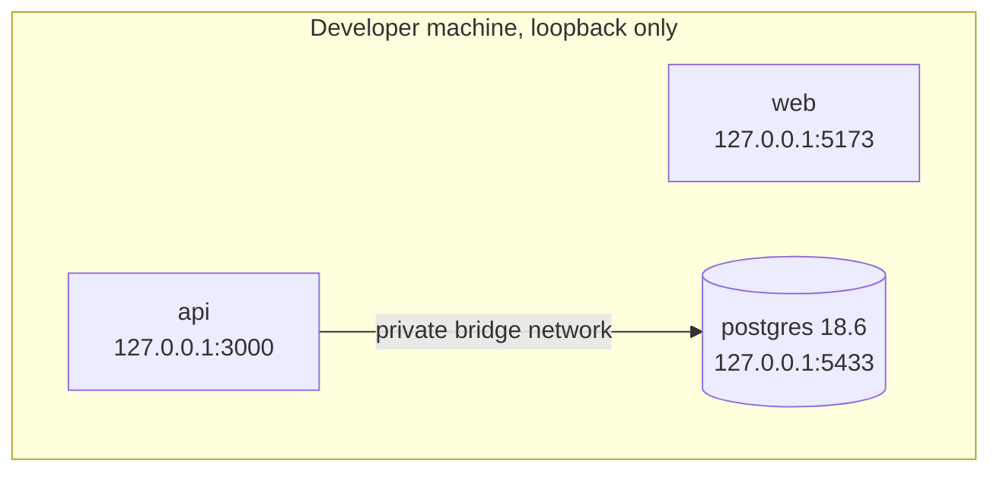
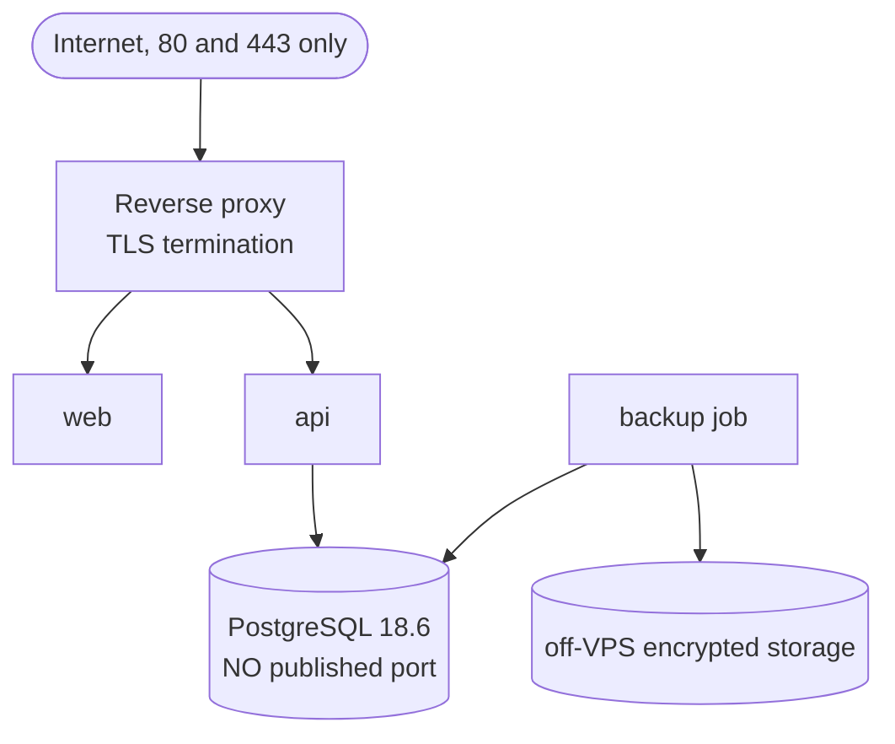

# Docker and VPS Strategy

Status: **partly implemented.** Local development Compose exists. **No VPS has
been accessed, configured, or deployed to.**

## Port exposure: the rule and why it is not obvious

Every published port in local development is bound to the loopback address:

```yaml
ports:
  - "127.0.0.1:5433:5432"   # PostgreSQL
  - "127.0.0.1:3000:3000"   # API
  - "127.0.0.1:5173:5173"   # web preview
```

Writing `5433:5432` instead would bind `0.0.0.0` and expose the database on
every network interface.

**Docker-published ports can bypass UFW.** Docker inserts its DNAT rules into
the iptables `DOCKER` chain, which is traversed *before* UFW's `INPUT` rules.
A `ufw deny 5432` therefore does **not** block a port Docker has published on
`0.0.0.0`. An operator who has configured UFW correctly can still be exposed.
The controls that actually hold are:

1. binding published ports to `127.0.0.1` (development),
2. publishing **no** port at all and using the private Docker network
   (production PostgreSQL),
3. `DOCKER-USER` chain rules as defence-in-depth on the VPS.

Inside containers, services bind `0.0.0.0` so Docker can route to them. That is
correct and is not in tension with the rule above: the container's bind address
and the host's publishing address are different controls.

## Local development topology



### First-time setup

Before the first run, create the local environment file:

```
cp .env.example .env
```

Then set `POSTGRES_PASSWORD` to a local-only value and use that same value in
`DATABASE_URL`. `web/.env` is git-ignored and must never be committed. Compose
fails without it, because that file supplies the `POSTGRES_*` substitutions.

**Two connection targets, deliberately different.** `DATABASE_URL` in
`web/.env` is the **host-side** value and must point at `127.0.0.1:5433`, the
published loopback port. Compose never reads it: the compose file builds its
own **container-side** URL from the `POSTGRES_*` values, reaching
`postgres:5432` on the private Docker network. The hostname `postgres`
resolves only inside that network, so a host-side process using it cannot
connect.

If you created `web/.env` before this rule was documented, check that its
`DATABASE_URL` uses `127.0.0.1:5433` and not `postgres:5432`.

### Running the API directly on the host

Useful for a fast edit-and-restart loop without rebuilding a container. Start
the database first, then from `web`:

```
docker compose --env-file .env -f docker/docker-compose.dev.yml up -d --wait postgres
npm run dev --workspace apps/api
```

The `dev` script loads `web/.env` through Node's own `--env-file` flag, so no
extra dependency is involved. It fails immediately and by design if
`web/.env` is missing, rather than starting with an empty connection string
and reporting a confusing readiness failure.

Run from the `web` directory:

```
docker compose --env-file .env -f docker/docker-compose.dev.yml up --wait
docker compose --env-file .env -f docker/docker-compose.dev.yml ps
docker compose --env-file .env -f docker/docker-compose.dev.yml down
```

`--env-file .env` is required because the compose file lives in `web/docker/`
while the environment file lives at `web/.env`; without it, variable
substitution would look in the wrong directory.

### Never use `down -v` as routine shutdown

`docker compose down -v` deletes named volumes, which means deleting the
development database. Normal shutdown is `docker compose down`. Destroying a
volume is a separate, explicitly approved action, never part of a routine
workflow.

## Health checks

Every long-running service declares a health check, and `up --wait` is only
considered successful when every service reports healthy.

| Service | Check | Why this mechanism |
| --- | --- | --- |
| postgres | `pg_isready` | Present in the official image |
| api | `node -e "fetch('http://127.0.0.1:3000/health')..."` | The `slim` image ships no `curl` or `wget`; Node's built-in `fetch` avoids installing a utility purely to poll a local endpoint |
| web | `node -e "fetch('http://127.0.0.1:5173/')..."` | Same reasoning |

The API depends on `postgres` with `condition: service_healthy`, so it never
starts against a database that is still initialising.

## Production topology (planned, not built)



Rules for production:

- only 80 and 443 published; PostgreSQL has **no `ports:` key at all**,
- images pinned by explicit tag **and digest**, never `latest`,
- secrets through Docker secrets or an equivalent approved mechanism, never in
  an image layer and never committed,
- health checks and restart policies on every service,
- log rotation configured,
- debugging and detailed internal error output disabled,
- development, staging, and production configuration kept separate.

### Controlled image updates

Image versions do not float. The update process is: review quarterly, or
immediately on a security advisory; bump the tag; re-resolve the digest; test in
staging; deploy; record the change here. There is no automatic image update in
production.

## VPS state

The VPS has been prepared by the owner (Ubuntu 24.04 updated, UFW active, SSH
key login for a non-root sudo user, root SSH login disabled, a read-only deploy
key configured). **The repository has not been cloned onto it, Docker has not
been configured on it, and nothing has been deployed.** No deployment or
rollback procedure has been exercised, so none is documented here as working.
